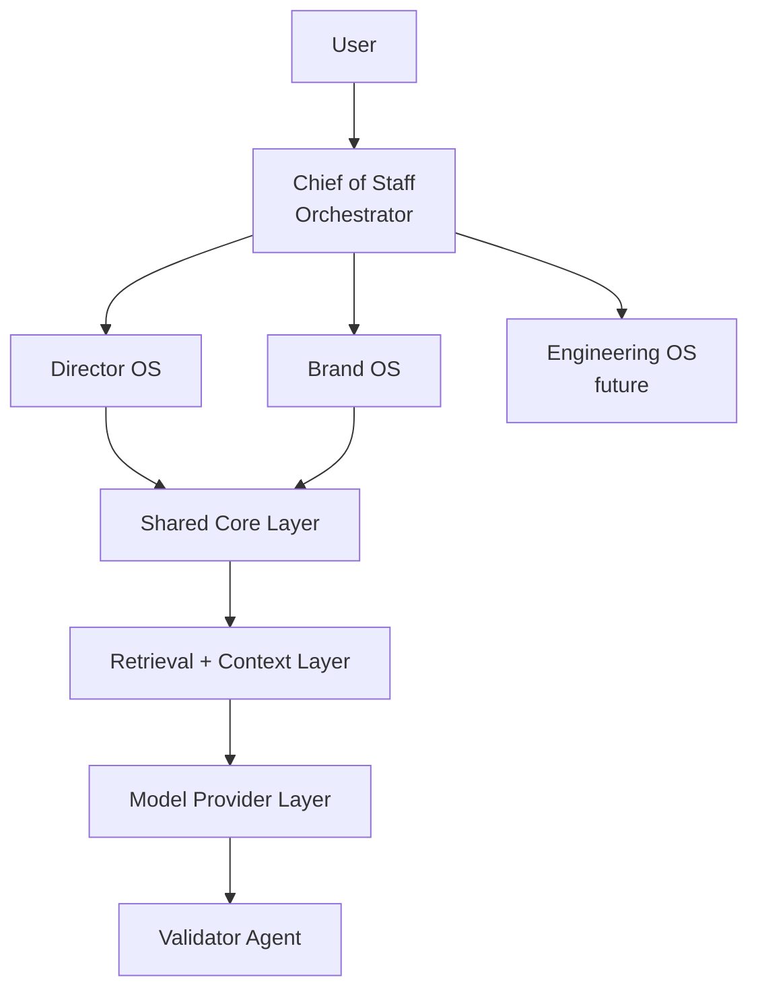

# AI Operating System (AI-OS)

AI-OS is a local-first, multi-agent AI system designed to help technical leaders operate effectively across:

- `Director OS`: project management, team insights, executive reporting
- `Brand OS`: podcast, open source, thought leadership, content creation

Built with a focus on:

- Privacy by default, with local-first operation and no internet requirement
- Cost-conscious defaults using local models
- Modular agent architecture
- Grounded, evidence-based outputs
- Pluggable model providers, starting local and extending to hybrid setups when needed

## Why This Exists

Technical leaders operate across fragmented systems:

- Jira for project tracking
- Docs for context and planning
- Meetings for decisions and follow-up
- Repositories for execution

This creates:

- Information overload
- Lost context across tools
- Time spent synthesizing instead of deciding

AI-OS exists to turn fragmented inputs into structured, actionable insight without defaulting to cloud-dependent or opaque agent behavior.

## Purpose

AI-OS is not a generic chatbot.

It is a structured system of agents intended to help you:

- Synthesize information across multiple sources
- Surface risks and insights
- Turn work into content and influence
- Operate consistently across projects and personal brand efforts

## System Overview



`Engineering OS` is a future extension for code-oriented workflows such as repository analysis, implementation assistance, and engineering execution support.

## Director OS

Focus: day-to-day leadership and operational clarity.

Responsibilities:

- Project status synthesis
- Risk and blocker detection
- Meeting and 1:1 insights
- Executive update generation

Example inputs:

- Jira exports
- Roadmap documents
- Meeting notes
- 1:1 notes

Example outputs:

- Weekly leadership update
- Top risks and blockers
- Project health summaries

## Brand OS

Focus: personal brand, content, and influence.

Responsibilities:

- Insight extraction from real work
- Content generation for posts, podcast ideas, and workshops
- Open source positioning
- Idea generation

Example inputs:

- Local repositories
- Notes and experiments
- Workshop material
- Podcast drafts

Example outputs:

- LinkedIn posts
- Podcast episode ideas
- README improvements
- Workshop explanations

## Core Components

### Orchestrator (Chief of Staff)

- Interprets user requests
- Routes tasks to agents
- Aggregates outputs

### Domain Agents

Specialized agents with strict roles, such as:

- Project Intelligence
- Team Signal
- Insight
- Content

### Retrieval Layer

- Searches local data sources
- Provides grounded context to agents
- Reduces hallucination by limiting scope to retrieved evidence

### Model Provider Layer

- Ollama as the default local model runtime
- External providers are optional and explicitly opt-in
- Abstracted provider interface so local-first remains the default execution mode

### Validator Agent

Acts as the final quality gate and enforces:

- Evidence-based outputs
- Low verbosity
- No unsupported claims

## Design Principles

### Local-First

- No internet required
- All data remains on-device by default

### Grounded Outputs

- Responses should be based on retrieved context
- Non-trivial claims should include source references when evidence is available

### Structured Responses

- Short, actionable outputs
- Signal over noise

### Deterministic Workflows

- No uncontrolled autonomy
- Clear, repeatable execution paths

### Human-in-the-Loop

- The user retains final judgment and control

## Current MVP Status

The repository now includes a minimal Phase 1 slice for `Director OS`:

- A local FastAPI service in `apps/api`
- A lightweight Chief of Staff orchestration endpoint for deterministic routing
- A graph-backed weekly update workflow in `director_os/workflows` and `packages/shared/graphs`
- A first Brand OS content-draft workflow in `brand_os/workflows`
- Shared schemas, retrieval, and validation logic in `packages/shared`
- An explicit provider layer for optional Ollama-backed synthesis
- Optional `LangSmith` tracing for the `Director OS` graph
- A small checked-in `Director OS` evaluation set and CLI runner
- Sample local project and brand data in `data/local_only`
- Focused tests for retrieval and validation behavior

The broader system described below is still the target state rather than the full current implementation.

The phased execution roadmap for closing that gap is documented in [plan.md](plan.md).

## Repository Structure (Target State)

The structure below reflects intended direction as the MVP grows:

```text
/ai-os
  /apps
    /web        # Frontend (e.g. Next.js)
    /api        # Backend (e.g. FastAPI)

  /packages
    /shared
      /prompts
      /schemas
      /retrieval
      /validation
      /providers

  /director_os
    agents/
    workflows/

  /brand_os
    agents/
    workflows/

  /data
    /local_only
      /projects
      /notes
      /repos
      /podcast

  /config
    models.yaml
    routing.yaml
```

## MVP Technology Stack

The intended initial stack is:

- `Ollama` for cost-conscious local inference
- `Python` for orchestration and backend logic
- `FastAPI` for a local API layer
- `Pydantic` for schemas and validation contracts
- `LangGraph` for explicit workflow orchestration and state transitions
- `LangChain` for model and tool abstractions where those abstractions reduce boilerplate without defining the product
- `LangSmith` for traces, debugging, and evaluation as workflows become more agentic
- Start with simple local file-based retrieval
- Introduce `FAISS` or `Chroma` only if retrieval complexity justifies it
- `Markdown`, `CSV`, and `JSON` as common local input formats

These framework choices are implementation infrastructure, not the product identity. AI-OS should present operating domains, workflows, retrieval, validation, and operator control as the primary concepts. The repo should not read like a `lang*` demo.

The frontend is optional in the first slice. If added, it should focus on workflow traceability rather than chat-style interaction:

- `Next.js` or `React` for a local UI
- Execution trace and validation state over animated "agent chat"
- `Langflow` can be useful later for visual prototyping and demo support, but it should not become the system of record for workflow definitions

## Implementation Plan

The initial build should stay narrow and prove the system with one end-to-end local workflow before expanding.

Phase 1:

- Build a single `Director OS` workflow
- Accept local project notes or exports as input
- Retrieve evidence from local files
- Route through the orchestrator
- Produce structured output with validator checks

Phase 1 status:

- Implemented as a minimal local weekly-update endpoint
- Implemented as a minimal orchestration endpoint: `POST /orchestrate`
- Current endpoint: `POST /director-os/weekly-update`
- Current support: local markdown retrieval, graph-backed workflow execution, concise structured output, evidence list, validation checks
- Current multi-domain support: `director_os.weekly_update` and `brand_os.content_draft`
- Optional next-phase support: local Ollama-backed synthesis with deterministic fallback
- Implemented: `Director OS` runs through an explicit `LangGraph` state graph while keeping the public API and AI-OS terminology stable
- Implemented: optional `LangSmith` tracing and a small checked-in `Director OS` evaluation set
- Planned next: expand evaluation coverage and reuse the same quality harness across more workflows
- Not yet implemented: UI trace view, broader multi-workflow orchestration

Phase 2:

- Reuse the same shared core for one `Brand OS` workflow
- Turn real work artifacts into grounded content drafts
- Expose workflow state and evidence in a simple local UI

Phase 3:

- Add stronger retrieval infrastructure if plain file retrieval becomes limiting
- Expand provider support only if local-first constraints remain intact
- Add more domain agents without weakening determinism or validation

## Non-Goals

This project intentionally does not aim to:

- Build fully autonomous agents
- Replace human decision-making
- Maximize agent complexity or parallelism for its own sake
- Depend on cloud APIs for core functionality

The focus is on clarity, reliability, grounded reasoning, and operator control.

## Example Workflows

### Director OS

Input:

```text
Prepare my weekly update
```

Output:

- Key wins
- Risks and blockers
- Next steps
- Evidence-backed insights

### Brand OS

Input:

```text
I worked on RAG evaluation this week
```

Output:

- Insight summary
- Content draft such as a post or outline
- Potential podcast topic
- Repository improvement suggestions

## Quickstart

Requirements:

- Python 3.11+

Install dependencies:

```bash
python -m venv .venv
.venv\Scripts\activate
pip install -e ".[dev]"
```

On macOS or Linux, use:

```bash
source .venv/bin/activate
```

Run the local API:

```bash
uvicorn apps.api.main:app --reload
```

Call the Phase 1 MVP endpoint:

```bash
curl -X POST http://127.0.0.1:8000/director-os/weekly-update \
  -H "Content-Type: application/json" \
  -d '{
    "data_path": "data/local_only/projects",
    "focus": "leadership update",
    "max_documents": 5
  }'
```

Call the Chief of Staff orchestrator endpoint:

```bash
curl -X POST http://127.0.0.1:8000/orchestrate \
  -H "Content-Type: application/json" \
  -d '{
    "prompt": "Prepare my leadership weekly update",
    "data_path": "data/local_only/projects",
    "max_documents": 10
  }'
```

Call the Brand OS workflow directly through the orchestrator:

```bash
curl -X POST http://127.0.0.1:8000/orchestrate \
  -H "Content-Type: application/json" \
  -d '{
    "prompt": "Turn this work into a podcast and LinkedIn content draft",
    "data_path": "data/local_only/brand",
    "max_documents": 5
  }'
```

Call the optional Ollama-backed path:

```bash
curl -X POST http://127.0.0.1:8000/director-os/weekly-update \
  -H "Content-Type: application/json" \
  -d '{
    "data_path": "data/local_only/projects",
    "focus": "leadership update",
    "max_documents": 5,
    "use_model": true,
    "ollama_url": "http://127.0.0.1:11434",
    "ollama_model": "llama3.2"
  }'
```

Run tests:

```bash
pytest
```

Run the checked-in `Director OS` evaluation set locally on demand:

```bash
python scripts/run_director_os_evals.py
```

This local mode is the default quality-check path:

- it runs fully on demand
- it does not require LangSmith
- it is the version we can safely add to CI later

Run the same evaluation set on demand with LangSmith result upload enabled:

```bash
python scripts/run_director_os_evals.py --langsmith
```

Use the LangSmith-backed mode when you want experiment history, evaluator results in the LangSmith UI, or a shareable compare link.

For LangSmith-backed eval runs:

- Set `LANGSMITH_API_KEY`, `LANGSMITH_TRACING=true`, and `LANGSMITH_PROJECT=ai-os`
- US workspaces use the default endpoint
- EU workspaces must set `LANGSMITH_ENDPOINT=https://eu.api.smith.langchain.com`
- Run the command from the same terminal session where those env vars are set

## Important Notes

- This system is not autonomous
- Agents operate within strict constraints
- Accuracy and clarity are prioritized over creativity
- Local execution and cost-efficient operation are default design requirements
- Outputs should be reviewed before external use

## Contributing

Contributions are welcome.

Useful focus areas:

- Agent design patterns
- Local-first AI workflows
- Retrieval and grounding improvements
- UI and UX improvements for structured workflows

## SDLC and CI

The project uses lightweight GitHub Actions to keep quality checks cheap and fast:

- Repository checks run on pull requests to `main`, on pushes, and through manual dispatch
- Python checks automatically run when a `pyproject.toml`-based MVP exists
- CI installs the project, runs `ruff`, compiles Python sources, runs `pytest` with coverage output, and executes the local `Director OS` eval runner
- Concurrency cancellation is enabled to avoid wasting minutes on stale branch runs
- Tag-based release workflows build Python artifacts without introducing paid deployment tooling

The intent is to keep the workflow production-minded without adding paid infrastructure or unnecessary pipeline complexity early.

## Final Thought

> This is not just an AI project.
> It is a system designed to help you think, decide, and operate better.
