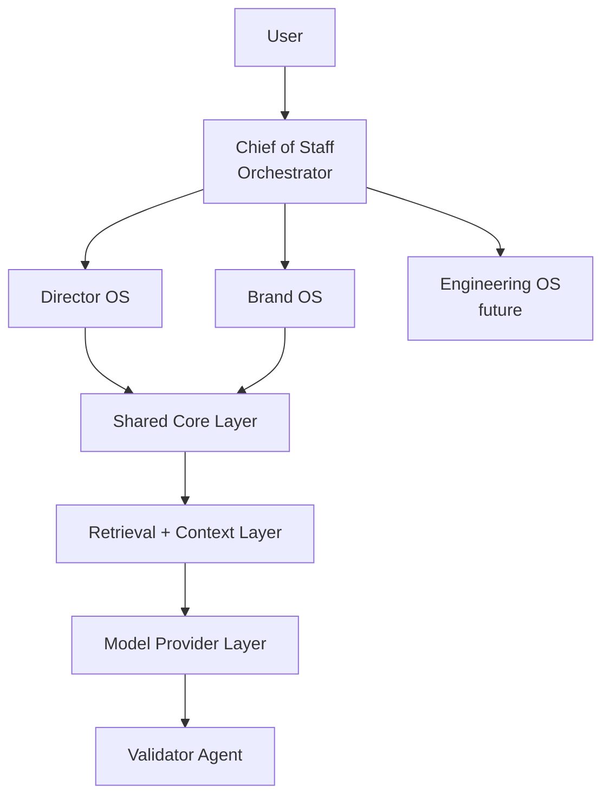

# AI Operating System (AI-OS)

AI-OS is a local-first, multi-agent AI system designed to help technical leaders operate effectively across:

- `Director OS`: project management, team insights, executive reporting
- `Brand OS`: podcast, open source, thought leadership, content creation

Built with a focus on:

- Privacy by default, with local-first operation and no internet requirement
- Modular agent architecture
- Grounded, evidence-based outputs
- Pluggable model providers, starting local and extending to hybrid setups when needed

## Purpose

AI-OS is not a generic chatbot.

It is a structured system of agents intended to help you:

- Synthesize information across multiple sources
- Surface risks and insights
- Turn work into content and influence
- Operate consistently across projects and personal brand efforts

## System Overview



## Director OS

Focus: day-to-day leadership and operational clarity.

Responsibilities:

- Project status synthesis
- Risk and blocker detection
- Meeting and 1:1 insights
- Executive update generation

Example inputs:

- Jira exports
- Roadmap documents
- Meeting notes
- 1:1 notes

Example outputs:

- Weekly leadership update
- Top risks and blockers
- Project health summaries

## Brand OS

Focus: personal brand, content, and influence.

Responsibilities:

- Insight extraction from real work
- Content generation for posts, podcast ideas, and workshops
- Open source positioning
- Idea generation

Example inputs:

- Local repositories
- Notes and experiments
- Workshop material
- Podcast drafts

Example outputs:

- LinkedIn posts
- Podcast episode ideas
- README improvements
- Workshop explanations

## Core Components

### Orchestrator (Chief of Staff)

- Interprets user requests
- Routes tasks to agents
- Aggregates outputs

### Domain Agents

Specialized agents with strict roles, such as:

- Project Intelligence
- Team Signal
- Insight
- Content

### Retrieval Layer

- Searches local data sources
- Provides grounded context to agents
- Reduces hallucination by limiting scope to retrieved evidence

### Model Provider Layer

- Local model support by default
- Optional external providers in future iterations
- Abstracted interface for flexibility

### Validator Agent

Acts as the final quality gate and enforces:

- Evidence-based outputs
- Low verbosity
- No unsupported claims

## Design Principles

### Local-First

- No internet required
- All data remains on-device by default

### Grounded Outputs

- Responses should be based on retrieved context
- Agents should cite sources when possible

### Structured Responses

- Short, actionable outputs
- Signal over noise

### Deterministic Workflows

- No uncontrolled autonomy
- Clear, repeatable execution paths

### Human-in-the-Loop

- The user retains final judgment and control

## Planned Project Structure

The repository is currently minimal. The structure below reflects intended direction, not necessarily current implementation:

```text
/ai-os
  /apps
    /web        # Frontend (e.g. Next.js)
    /api        # Backend (e.g. FastAPI)

  /packages
    /shared
      /prompts
      /schemas
      /retrieval
      /validation
      /providers

  /director_os
    agents/
    workflows/

  /brand_os
    agents/
    workflows/

  /data
    /local_only
      /projects
      /notes
      /repos
      /podcast

  /config
    models.yaml
    routing.yaml
```

## Technology Direction

Likely components for the system include:

- Local LLM runtime such as Ollama
- Python for orchestration and backend logic
- FastAPI for an API layer
- Next.js or React for the frontend
- FAISS or Chroma for local retrieval
- Markdown, CSV, and JSON as common input formats

## Example Workflows

### Director OS

Input:

```text
Prepare my weekly update
```

Output:

- Key wins
- Risks and blockers
- Next steps
- Evidence-backed insights

### Brand OS

Input:

```text
I worked on RAG evaluation this week
```

Output:

- Insight summary
- Content draft such as a post or outline
- Potential podcast topic
- Repository improvement suggestions

## Important Notes

- This system is not autonomous
- Agents should operate within strict constraints
- Accuracy and clarity are prioritized over creativity
- Outputs should be reviewed before external use

## Contributing

Contributions are welcome.

Useful focus areas:

- Agent design patterns
- Local-first AI workflows
- Retrieval and grounding improvements
- UI and UX improvements for structured workflows

## Final Thought

> This is not just an AI project.
> It is a system designed to help you think, decide, and operate better.
