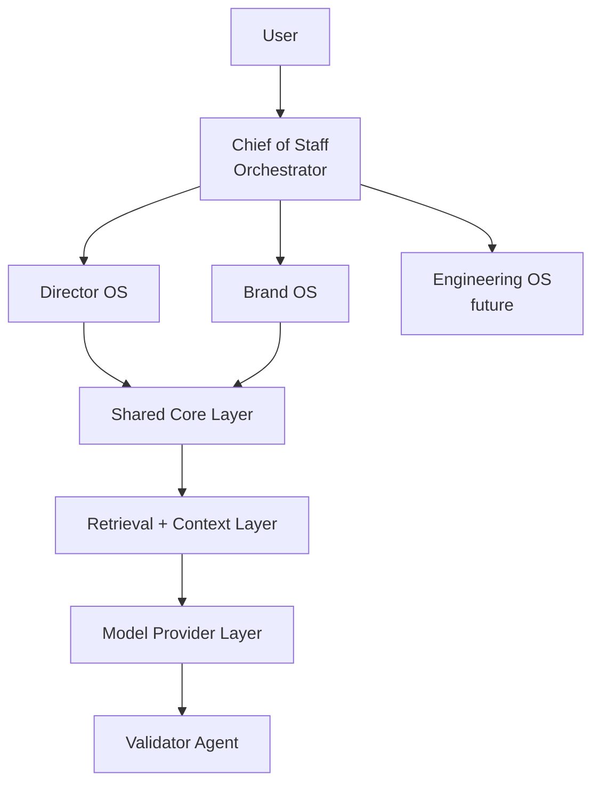

# AI Operating System (AI-OS)

AI-OS is a local-first, multi-agent AI system designed to help technical leaders operate effectively across:

- `Director OS`: project management, team insights, executive reporting
- `Brand OS`: podcast, open source, thought leadership, content creation

Built with a focus on:

- Privacy by default, with local-first operation and no internet requirement
- Cost-conscious defaults using local models
- Modular agent architecture
- Grounded, evidence-based outputs
- Pluggable model providers, starting local and extending to hybrid setups when needed

## Why This Exists

Technical leaders operate across fragmented systems:

- Jira for project tracking
- Docs for context and planning
- Meetings for decisions and follow-up
- Repositories for execution

This creates:

- Information overload
- Lost context across tools
- Time spent synthesizing instead of deciding

AI-OS exists to turn fragmented inputs into structured, actionable insight without defaulting to cloud-dependent or opaque agent behavior.

## Purpose

AI-OS is not a generic chatbot.

It is a structured system of agents intended to help you:

- Synthesize information across multiple sources
- Surface risks and insights
- Turn work into content and influence
- Operate consistently across projects and personal brand efforts

## System Overview



`Engineering OS` is a future extension for code-oriented workflows such as repository analysis, implementation assistance, and engineering execution support.

## Director OS

Focus: day-to-day leadership and operational clarity.

Responsibilities:

- Project status synthesis
- Risk and blocker detection
- Meeting and 1:1 insights
- Executive update generation

Example inputs:

- Jira exports
- Roadmap documents
- Meeting notes
- 1:1 notes

Example outputs:

- Weekly leadership update
- Top risks and blockers
- Project health summaries

## Brand OS

Focus: personal brand, content, and influence.

Responsibilities:

- Insight extraction from real work
- Content generation for posts, podcast ideas, and workshops
- Open source positioning
- Idea generation

Example inputs:

- Local repositories
- Notes and experiments
- Workshop material
- Podcast drafts

Example outputs:

- LinkedIn posts
- Podcast episode ideas
- README improvements
- Workshop explanations

## Core Components

### Orchestrator (Chief of Staff)

- Interprets user requests
- Routes tasks to agents
- Aggregates outputs

### Domain Agents

Specialized agents with strict roles, such as:

- Project Intelligence
- Team Signal
- Insight
- Content

### Retrieval Layer

- Searches local data sources
- Provides grounded context to agents
- Reduces hallucination by limiting scope to retrieved evidence

### Model Provider Layer

- Ollama as the default local model runtime
- External providers are optional and explicitly opt-in
- Abstracted provider interface so local-first remains the default execution mode

### Validator Agent

Acts as the final quality gate and enforces:

- Evidence-based outputs
- Low verbosity
- No unsupported claims

## Design Principles

### Local-First

- No internet required
- All data remains on-device by default

### Grounded Outputs

- Responses should be based on retrieved context
- Non-trivial claims should include source references when evidence is available

### Structured Responses

- Short, actionable outputs
- Signal over noise

### Deterministic Workflows

- No uncontrolled autonomy
- Clear, repeatable execution paths

### Human-in-the-Loop

- The user retains final judgment and control

## Repository Structure (Target State)

The repository is currently minimal. The structure below reflects intended direction, not necessarily current implementation:

```text
/ai-os
  /apps
    /web        # Frontend (e.g. Next.js)
    /api        # Backend (e.g. FastAPI)

  /packages
    /shared
      /prompts
      /schemas
      /retrieval
      /validation
      /providers

  /director_os
    agents/
    workflows/

  /brand_os
    agents/
    workflows/

  /data
    /local_only
      /projects
      /notes
      /repos
      /podcast

  /config
    models.yaml
    routing.yaml
```

## MVP Technology Stack

The intended initial stack is:

- `Ollama` for cost-conscious local inference
- `Python` for orchestration and backend logic
- `LangGraph` for deterministic workflow orchestration
- `FastAPI` for a local API layer
- `Pydantic` for schemas and validation contracts
- Start with simple local file-based retrieval
- Introduce `FAISS` or `Chroma` only if retrieval complexity justifies it
- `Markdown`, `CSV`, and `JSON` as common local input formats

The frontend is optional in the first slice. If added, it should focus on workflow traceability rather than chat-style interaction:

- `Next.js` or `React` for a local UI
- Execution trace and validation state over animated "agent chat"

## Implementation Plan

The initial build should stay narrow and prove the system with one end-to-end local workflow before expanding.

Phase 1:

- Build a single `Director OS` workflow
- Accept local project notes or exports as input
- Retrieve evidence from local files
- Route through the orchestrator
- Produce structured output with validator checks

Phase 2:

- Reuse the same shared core for one `Brand OS` workflow
- Turn real work artifacts into grounded content drafts
- Expose workflow state and evidence in a simple local UI

Phase 3:

- Add stronger retrieval infrastructure if plain file retrieval becomes limiting
- Expand provider support only if local-first constraints remain intact
- Add more domain agents without weakening determinism or validation

## Non-Goals

This project intentionally does not aim to:

- Build fully autonomous agents
- Replace human decision-making
- Maximize agent complexity or parallelism for its own sake
- Depend on cloud APIs for core functionality

The focus is on clarity, reliability, grounded reasoning, and operator control.

## Example Workflows

### Director OS

Input:

```text
Prepare my weekly update
```

Output:

- Key wins
- Risks and blockers
- Next steps
- Evidence-backed insights

### Brand OS

Input:

```text
I worked on RAG evaluation this week
```

Output:

- Insight summary
- Content draft such as a post or outline
- Potential podcast topic
- Repository improvement suggestions

## Important Notes

- This system is not autonomous
- Agents operate within strict constraints
- Accuracy and clarity are prioritized over creativity
- Local execution and cost-efficient operation are default design requirements
- Outputs should be reviewed before external use

## Contributing

Contributions are welcome.

Useful focus areas:

- Agent design patterns
- Local-first AI workflows
- Retrieval and grounding improvements
- UI and UX improvements for structured workflows

## Final Thought

> This is not just an AI project.
> It is a system designed to help you think, decide, and operate better.
