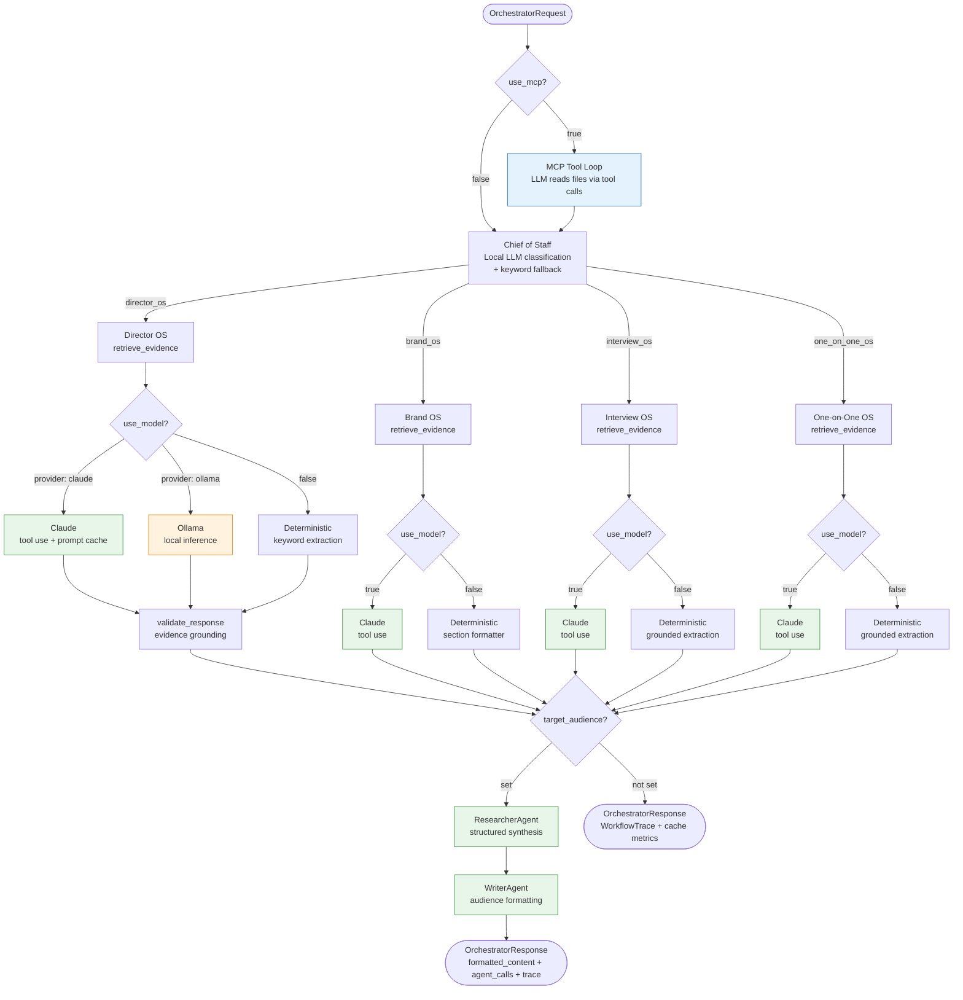

# AI Operating System (AI-OS)

AI-OS is a production-grade multi-agent system that synthesizes fragmented information — project notes, team signals, candidate briefs, meeting prep — into structured, evidence-grounded output.

Four workflow domains share a common architecture: a routing layer that classifies incoming requests and dispatches them to the right domain graph, a retrieval layer that pulls relevant evidence from local markdown files or a semantic vector store, a synthesis layer that produces structured output with mandatory source citations, and a validation layer that enforces grounding before any response reaches the API.

---

**Recruiter / hiring manager walkthrough:** [SHOWCASE.md](SHOWCASE.md) — use cases, domain walkthroughs with live curl examples, and the engineering decisions behind the system.

---

## Why this matters

Production AI deployment fails in predictable ways: hallucinated content with no citation trail, model paths that break silently when the LLM is unavailable, no way to measure whether synthesis quality regresses as the system evolves, and observability that requires code changes to turn on or off. AI-OS is designed to address all four at the architecture level — not as afterthoughts, but as invariants.

Evidence grounding is enforced at the schema level via forced tool use: every output item must carry a `source` filename and `line_number`. The system has no path to a response with an uncited item. Deterministic fallback is always available — if model synthesis fails or no API key is present, the system produces grounded output from keyword extraction with no silent degradation. The evaluation harness runs 22 cases across three retrieval paths in CI on every PR. Observability is opt-in by environment variable: setting `LANGSMITH_TRACING=true` emits node-level traces across all four domain graphs with no code changes.

---

## Domains

| Domain | What it synthesizes |
|---|---|
| **Director OS** | Project notes → wins, risks, next steps for a weekly leadership update |
| **Brand OS** | Technical work notes → content post outlines, podcast angles, repo improvements |
| **Interview OS** | Hiring notes → candidate brief with key questions, talking points, red flags |
| **One-on-One OS** | Direct report notes → meeting brief with action items, blockers, kudos |

---

## What this demonstrates

| Capability | Implementation |
|---|---|
| Multi-domain LLM orchestration | Chief of Staff router + 4 domain LangGraph graphs |
| In-process MCP tool loop | `packages/shared/mcp/filesystem_server.py` + `orchestrator_integration.py` |
| Standalone MCP server | `apps/mcp/server.py` — all 4 domains as MCP tools |
| Schema-enforced evidence grounding | Forced tool use with required `source` + `line_number` fields |
| Provider abstraction | `base.py` interface; `claude.py` / `ollama.py` / `grounding.py` implementations |
| Pluggable retrieval backend | Keyword (`local_files.py`) or semantic (`chroma.py`) via env var |
| Multi-agent pipeline | `ResearcherAgent → WriterAgent` with structured handoff contract |
| LLM evaluation framework | 22 cases, 3 retrieval paths, committed results, CI-gated |
| Node-level observability | LangSmith `@traceable` on all 4 domain graphs — silent no-op without config |
| Prompt caching + cost visibility | `cache_read_input_tokens` / `cache_creation_input_tokens` in every `WorkflowTrace` |

The architecture is designed to be adapted. The provider layer, the in-process filesystem tool loop, and the standalone MCP server are all swappable — designed for the kind of environment customization that enterprise AI work requires.

---

## Architecture

The system has three independently configurable layers: routing, retrieval, and synthesis. Swapping any layer — routing model, retrieval backend, synthesis provider — requires a single field change, not a workflow rewrite.

**Routing** — The Chief of Staff router classifies each request using a local LLM with a compact one-token classification prompt (`director_os`, `brand_os`, `interview_os`, `one_on_one_os`). When the local model is unreachable, it falls back to keyword rules automatically. Routing decisions don't need reasoning depth — they need to be fast, free, and zero-data-egress. A cloud LLM call on a classification task that returns one word is waste.

**Retrieval** — Two backends share a common interface. The keyword backend (`local_files.py`) does BM25-style scoring with no external dependencies — it runs in CI with no services required. The semantic backend (`chroma.py`) uses ChromaDB with `nomic-embed-text` embeddings via Ollama for richer recall. The backend selector reads `RETRIEVAL_BACKEND` from the environment and switches automatically. If the Chroma index is absent, it falls through to keyword retrieval.

**Synthesis** — Each domain runs as a compiled LangGraph `StateGraph` with typed state. Nodes: `retrieve_evidence → build_draft → assemble_response → validate_response`. A conditional edge after `build_response` routes to `deterministic_fallback` when model synthesis fails and `fallback_to_deterministic=True`. The provider abstraction means switching synthesis providers is a single field on the request — no workflow logic changes.


```mermaid
flowchart TB
    In([OrchestratorRequest]) --> MCP{"use_mcp?"}
    MCP -->|true| MCPLoop["MCP Tool Loop<br/>LLM reads files via tool calls"]
    MCP -->|false| CoS["Chief of Staff<br/>Local LLM classification<br/>+ keyword fallback"]
    MCPLoop --> CoS

    CoS -->|director_os| Dir["Director OS<br/>retrieve_evidence"]
    CoS -->|brand_os| Brand["Brand OS<br/>retrieve_evidence"]
    CoS -->|interview_os| Interview["Interview OS<br/>retrieve_evidence"]
    CoS -->|one_on_one_os| OneOnOne["One-on-One OS<br/>retrieve_evidence"]

    Dir --> DModel{"use_model?"}
    DModel -->|"provider: claude"| DC["Claude<br/>tool use + prompt cache"]
    DModel -->|"provider: ollama"| DO["Ollama<br/>local inference"]
    DModel -->|false| DDet["Deterministic<br/>keyword extraction"]
    DC --> DVal["validate_response<br/>evidence grounding"]
    DO --> DVal
    DDet --> DVal

    Brand --> BModel{"use_model?"}
    BModel -->|true| BC["Claude<br/>tool use"]
    BModel -->|false| BDet["Deterministic<br/>section formatter"]

    Interview --> IModel{"use_model?"}
    IModel -->|true| IC["Claude<br/>tool use"]
    IModel -->|false| IDet["Deterministic<br/>grounded extraction"]

    OneOnOne --> OModel{"use_model?"}
    OModel -->|true| OC["Claude<br/>tool use"]
    OModel -->|false| ODet["Deterministic<br/>grounded extraction"]

    DVal --> TA{"target_audience?"}
    BC --> TA
    BDet --> TA
    IC --> TA
    IDet --> TA
    OC --> TA
    ODet --> TA

    TA -->|set| Researcher["ResearcherAgent<br/>structured synthesis"]
    Researcher --> Writer["WriterAgent<br/>audience formatting"]
    Writer --> RespA(["OrchestratorResponse<br/>formatted_content + agent_calls + trace"])
    TA -->|not set| RespB(["OrchestratorResponse<br/>WorkflowTrace + cache metrics"])

    style DC fill:#e8f5e9,stroke:#388e3c
    style BC fill:#e8f5e9,stroke:#388e3c
    style IC fill:#e8f5e9,stroke:#388e3c
    style OC fill:#e8f5e9,stroke:#388e3c
    style Researcher fill:#e8f5e9,stroke:#388e3c
    style Writer fill:#e8f5e9,stroke:#388e3c
    style DO fill:#fff3e0,stroke:#f57c00
    style MCPLoop fill:#e3f2fd,stroke:#1565c0
```

---

## Key design decisions

**Forced tool use over prompt instructions.** The grounding invariant is enforced via the LLM tool use API's JSON schema, not a system prompt instruction. A prompt instruction achieves correct citation ~95% of the time. A required schema field (`source` + `line_number` on every output item) achieves it structurally: the API call either produces a fully-cited response or raises a parse error, which triggers the deterministic fallback. There is no "approximately cited" middle ground.

**Schema as the single source of truth.** The same Pydantic `BaseModel` definitions drive FastAPI request validation, LangGraph state shape, eval case deserialization from JSON on disk, and LangSmith dataset sync. One schema change propagates through the full stack with no manual wiring.

**Evaluation tests failure modes, not just happy paths.** Each domain's eval suite includes cases for: baseline grounding pass, multi-file retrieval, provider failure (`_FailingProvider`), weak output / empty sections (`_WeakProvider`), and unsupported claims that cite wrong evidence (`_UnsupportedClaimProvider`). All three retrieval paths are CI-gated before merge.

**Multi-agent pipeline via information narrowing.** The `ResearcherAgent → WriterAgent` pipeline is not two models chatting. The researcher produces a structured `ResearchSynthesis` object via tool use. The writer receives only that object — not raw evidence. The writer can rephrase and reformat; it cannot introduce information the researcher didn't extract. Hallucination surface is bounded to the reformatting step.

**Prompt caching on the evidence block.** The evidence block is marked with `cache_control: {"type": "ephemeral"}` on every synthesis call. On repeated queries against the same document set — the normal usage pattern — the LLM reuses the cached KV representation. Savings surface in every `WorkflowTrace` via `cache_read_input_tokens` and `cache_creation_input_tokens`.

---

## Quick start

Requirements: Python 3.11+

```bash
python -m venv .venv && source .venv/bin/activate
pip install -e ".[dev]"
cp .env.example .env
uvicorn apps.api.main:app --reload --env-file .env
```

The system runs fully without any API keys. Model synthesis is opt-in via `use_model=True` on any request. Open the operator console at `http://127.0.0.1:8000/`.

```bash
# Run all local evals — no API key required
python scripts/run_director_os_evals.py
python scripts/run_brand_os_evals.py
python scripts/run_interview_os_evals.py
python scripts/run_one_on_one_os_evals.py

# Run tests
pytest tests/ -v
```

---

## Working with Claude

Set `ANTHROPIC_API_KEY` in `.env`. The Claude provider activates automatically — no code changes required.

```bash
# Director OS — weekly update with Claude
curl -X POST http://127.0.0.1:8000/director-os/weekly-update \
  -H "Content-Type: application/json" \
  -d '{
    "data_path": "data/local_only/projects",
    "focus": "leadership update",
    "use_model": true,
    "provider": "claude"
  }'
```

Every response includes a `trace` object showing which tools were called, what data was retrieved, and token counts including cache hits:

```json
{
  "result": "...",
  "trace": {
    "mcp_tool_calls": [
      {
        "tool": "read_file",
        "input": {"path": "projects/weekly-notes.md"},
        "success": true,
        "result_preview": "# Week of June 2026..."
      }
    ],
    "total_input_tokens": 842,
    "cache_read_input_tokens": 680,
    "total_output_tokens": 312
  }
}
```

Falls back to the Ollama / deterministic path when the key is absent.

---

## MCP entry points

Two MCP integration patterns:

**In-process tool loop** — When `use_mcp=True` on `/orchestrate`, the LLM calls `list_files`, `read_file`, and `search_content` tools autonomously. The orchestrator executes each call, appends the result to the message history, and continues until the model produces a final response. No pre-selected evidence — the model decides what to read.

**Standalone MCP server** — `apps/mcp/server.py` exports all four domain workflows as MCP tools (`director_os.weekly_update`, `brand_os.content_draft`, `interview_os.brief`, `one_on_one_os.brief`) for Claude Desktop or Claude Code. Wire via `claude_desktop_config.json` and all four workflows are available as tool calls without touching the HTTP API.

| Tool | Description |
|---|---|
| `list_files(path, pattern)` | Discover available project notes and docs |
| `read_file(path)` | Retrieve full file contents for synthesis |
| `search_content(path, query)` | Find documents mentioning a specific topic or risk |

---

## Eval results

All 22 eval cases pass across all four domains on local (keyword) and semantic (ChromaDB) retrieval paths. Results are committed — CI fails if any case regresses.

| Domain | Local (keyword) | Chroma (semantic) | Claude (live) |
|---|---|---|---|
| Director OS | 7/7 | 7/7 | 4/4 |
| Brand OS | 7/7 | 7/7 | 7/7 |
| Interview OS | 4/4 | 4/4 | 4/4 |
| One-on-One OS | 4/4 | 4/4 | 4/4 |
| **Total** | **22/22** | **22/22** | **19/19** |

Run ChromaDB semantic evals (requires local Ollama + `nomic-embed-text`):

```bash
python -m scripts.run_director_os_evals_chroma
python -m scripts.run_brand_os_evals_chroma
python -m scripts.run_interview_os_evals_chroma
python -m scripts.run_one_on_one_os_evals_chroma
```

Run LangSmith cloud-backed evals (requires `LANGSMITH_API_KEY`):

```bash
python scripts/run_director_os_evals.py --langsmith
```

---

## LangSmith observability

All four domain graphs emit node-level traces to LangSmith when `LANGSMITH_TRACING=true` and `LANGSMITH_API_KEY` are set. Every `graph.invoke()` call is wrapped with `get_langsmith_tracing_context()` and each graph node carries a `@traceable` decorator — full input/output visibility at every step with no extra instrumentation code.


Tracing is a silent no-op when the env vars are absent. Zero code paths branch on whether tracing is enabled.

```bash
# .env
LANGSMITH_TRACING=true
LANGSMITH_API_KEY=<your key>
```

---

## Model provider strategy

| Layer | Model | Workload |
|---|---|---|
| Local inference | Ollama (`llama3.2`) | Routing, classification, low-stakes summarization — free, on-device, no API key |
| Cloud synthesis | Claude Haiku | Structured output via tool use, MCP orchestration — cost-effective |
| Premium synthesis | Claude Sonnet / Opus | Complex or high-stakes runs — on demand |

All providers implement the same interface. Switching is a single field change on the request — no workflow logic changes required.

```bash
# Ollama — no API key required
curl -X POST http://127.0.0.1:8000/director-os/weekly-update \
  -H "Content-Type: application/json" \
  -d '{
    "data_path": "data/local_only/projects",
    "use_model": true,
    "provider": "ollama",
    "ollama_model": "llama3.2"
  }'
```

---

## Technology stack

| Layer | Tool |
|---|---|
| Language | Python 3.11+ |
| API | FastAPI + Pydantic |
| Workflow orchestration | LangGraph |
| LLM synthesis (cloud) | Claude — tool use, prompt caching |
| LLM inference (local) | Ollama (`llama3.2`, `nomic-embed-text`) |
| In-process MCP loop | `packages/shared/mcp/` |
| Standalone MCP server | `apps/mcp/server.py` |
| Semantic retrieval | ChromaDB + `nomic-embed-text` embeddings |
| Observability | LangSmith — `@traceable` on all 4 domain graphs, node-level traces |
| Evaluation | Per-domain harness — keyword, semantic, and cloud paths; results committed |
| CI/CD | GitHub Actions — lint, test, evals on every PR; no API keys required |

See [SHOWCASE.md](SHOWCASE.md) for a full mapping of how each tool is used, which features are exercised, and where each integration lives in the codebase.

---

## Why this exists

Technical leaders operate across fragmented systems — notes, roadmap docs, meeting prep, hiring pipelines — and spend significant time each week synthesizing that information into structured output for stakeholders. AI-OS automates that synthesis while keeping every output traceable to the source.

It is also a design artifact: a reference implementation for how production AI belongs in enterprise workflows. Provider abstraction that survives a model swap. MCP tool integration in two patterns. An evaluation framework that tests failure modes, not just happy paths. Observability that ships with the system. Deployment patterns that survive contact with real InfoSec requirements. The architecture is designed to be adapted — each layer is independently swappable for the kind of environment customization that enterprise AI deployment requires.
