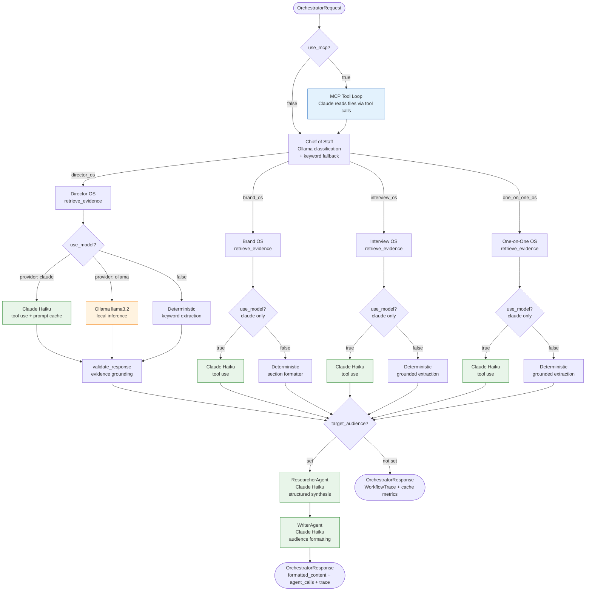
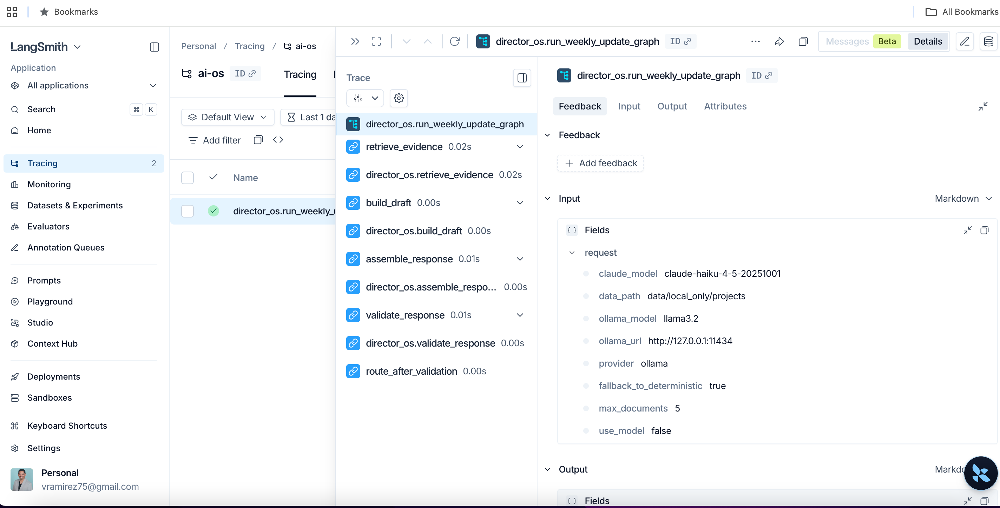

# AI Operating System (AI-OS)

AI-OS is a production-grade multi-agent system that helps technical leaders
synthesize fragmented information — project status, team signals, brand work,
candidate briefs, and 1:1 meeting prep — into structured, actionable output.

Four workflow domains: **Director OS**, **Brand OS**, **Interview OS**, and
**One-on-One OS**. Built on **Claude** (Anthropic) with **LangGraph
orchestration**, an in-process filesystem tool loop, and a **standalone MCP
server** for workflow entry points.

---

## What this demonstrates

| Capability | Implementation |
|---|---|
| Production Claude integration | `packages/shared/providers/claude_provider.py` |
| Four workflow domains | Director OS, Brand OS, Interview OS, One-on-One OS |
| In-process MCP tool loop | `packages/shared/mcp/filesystem_server.py` + `packages/shared/mcp/orchestrator_integration.py` |
| Standalone MCP server | `apps/mcp/server.py` — exports all 4 domain entry points as MCP tools |
| LLM evaluation framework | per-domain eval harness with committed results |
| Operator trace / observability | `trace.mcp_tool_calls` in every `/orchestrate` response |
| Repeatable deployment pattern | `docs/DEPLOYMENT.md` — secrets, eval gate, rollback, MCP adapters |
| LangGraph state graphs | `packages/shared/graphs/director_os.py`, `brand_os.py`, `interview_os.py`, `one_on_one_os.py` |
| LangSmith tracing | Node-level traces on all 4 domain graphs via `@traceable` — set `LANGSMITH_TRACING=true` + `LANGSMITH_API_KEY` |
| ChromaDB semantic retrieval | `packages/shared/retrieval/chroma.py` — embedding-based retrieval with `nomic-embed-text` via Ollama |
| Chroma eval harness | Per-domain chroma eval runners with `results_chroma.json` committed for all 4 domains |

The architecture is designed to be adapted. The provider layer, the
in-process filesystem tool loop, and the standalone MCP server are all
swappable — designed for the kind of customer environment customization that
enterprise AI work requires.

---

## Architecture


```mermaid
flowchart TB
    In([OrchestratorRequest]) --> MCP{"use_mcp?"}
    MCP -->|true| MCPLoop["MCP Tool Loop\nClaude reads files via tool calls"]
    MCP -->|false| CoS["Chief of Staff\nOllama classification\n+ keyword fallback"]
    MCPLoop --> CoS

    CoS -->|director_os| Dir["Director OS\nretrieve_evidence"]
    CoS -->|brand_os| Brand["Brand OS\nretrieve_evidence"]
    CoS -->|interview_os| Interview["Interview OS\nretrieve_evidence"]
    CoS -->|one_on_one_os| OneOnOne["One-on-One OS\nretrieve_evidence"]

    Dir --> DModel{"use_model?"}
    DModel -->|"provider: claude"| DC["Claude Haiku\ntool use + prompt cache"]
    DModel -->|"provider: ollama"| DO["Ollama llama3.2\nlocal inference"]
    DModel -->|false| DDet["Deterministic\nkeyword extraction"]
    DC --> DVal["validate_response\nevidence grounding"]
    DO --> DVal
    DDet --> DVal

    Brand --> BModel{"use_model?\nclaude only"}
    BModel -->|true| BC["Claude Haiku\ntool use"]
    BModel -->|false| BDet["Deterministic\nsection formatter"]

    Interview --> IModel{"use_model?\nclaude only"}
    IModel -->|true| IC["Claude Haiku\ntool use"]
    IModel -->|false| IDet["Deterministic\ngrounded extraction"]

    OneOnOne --> OModel{"use_model?\nclaude only"}
    OModel -->|true| OC["Claude Haiku\ntool use"]
    OModel -->|false| ODet["Deterministic\ngrounded extraction"]

    DVal --> TA{"target_audience?"}
    BC --> TA
    BDet --> TA
    IC --> TA
    IDet --> TA
    OC --> TA
    ODet --> TA

    TA -->|set| Researcher["ResearcherAgent\nClaude Haiku\nstructured synthesis"]
    Researcher --> Writer["WriterAgent\nClaude Haiku\naudience formatting"]
    Writer --> RespA(["OrchestratorResponse\nformatted_content + agent_calls + trace"])
    TA -->|not set| RespB(["OrchestratorResponse\nWorkflowTrace + cache metrics"])

    style DC fill:#e8f5e9,stroke:#388e3c
    style BC fill:#e8f5e9,stroke:#388e3c
    style IC fill:#e8f5e9,stroke:#388e3c
    style OC fill:#e8f5e9,stroke:#388e3c
    style Researcher fill:#e8f5e9,stroke:#388e3c
    style Writer fill:#e8f5e9,stroke:#388e3c
    style DO fill:#fff3e0,stroke:#f57c00
    style MCPLoop fill:#e3f2fd,stroke:#1565c0
```

---

## Quick start

Requirements: Python 3.11+

```bash
# Install
python -m venv .venv && source .venv/bin/activate
pip install -e ".[dev]"

# Copy env and optionally add your Anthropic API key
cp .env.example .env

# Run the API
uvicorn apps.api.main:app --reload --env-file .env

# Run all evals — local, no API key required
python scripts/run_director_os_evals.py
python scripts/run_brand_os_evals.py
python scripts/run_interview_os_evals.py
python scripts/run_one_on_one_os_evals.py

# Run tests (Claude tests skipped without API key)
pytest tests/ -v
```

---

## Working with Claude

The Claude provider is active when `ANTHROPIC_API_KEY` is set.
Falls back to the Ollama deterministic path when the key is absent —
no code changes required.

```bash
# Director OS — weekly update with Claude
curl -X POST http://127.0.0.1:8000/director-os/weekly-update \
  -H "Content-Type: application/json" \
  -d '{
    "data_path": "data/local_only/projects",
    "focus": "leadership update",
    "max_documents": 5
  }'
```

The response includes a `trace` object showing which MCP tools were called,
what data was retrieved, and token counts:

```json
{
  "result": "...",
  "trace": {
    "mcp_tool_calls": [
      {
        "tool": "read_file",
        "input": {"path": "projects/weekly-notes.md"},
        "success": true,
        "result_preview": "# Week of June 2026..."
      }
    ],
    "total_input_tokens": 842,
    "total_output_tokens": 312
  }
}
```

---

## MCP entry points

AI-OS supports two MCP-related paths:

1. The in-process filesystem tool loop used by the FastAPI `/orchestrate` flow.
2. The standalone MCP server in `apps/mcp/server.py`, which exports all four
   workflow domains as MCP tools for Claude Desktop or Claude Code:
   `director_os.weekly_update`, `brand_os.content_draft`,
   `interview_os.brief`, and `one_on_one_os.brief`.

The filesystem loop exposes three tools Claude can invoke during synthesis:

| Tool | Description |
|---|---|
| `list_files(path, pattern)` | Discover available project notes and docs |
| `read_file(path)` | Retrieve full file contents for synthesis |
| `search_content(path, query)` | Find documents mentioning a specific topic or risk |

Claude calls these autonomously during the orchestration loop. The orchestrator
executes each tool call, appends the result to the message history, and
continues until Claude produces a final text response.

---

## Eval results

All four domains have committed eval results across three retrieval paths:

| Domain | Local (keyword) | Chroma (semantic) | Claude (live) |
|---|---|---|---|
| Director OS | `weekly_update_cases.json` | `results_chroma.json` | `results_claude.json` |
| Brand OS | `content_draft_cases.json` | `results_chroma.json` | `results_claude.json` |
| Interview OS | `interview_cases.json` | `results_chroma.json` | `results_claude.json` |
| One-on-One OS | `meeting_brief_cases.json` | `results_chroma.json` | `results_claude.json` |

Run all local evals (no API key required):

```bash
python scripts/run_director_os_evals.py
python scripts/run_brand_os_evals.py
python scripts/run_interview_os_evals.py
python scripts/run_one_on_one_os_evals.py
```

Run ChromaDB semantic retrieval evals (requires local Ollama + `nomic-embed-text`):

```bash
python -m scripts.run_director_os_evals_chroma
python -m scripts.run_brand_os_evals_chroma
python -m scripts.run_interview_os_evals_chroma
python -m scripts.run_one_on_one_os_evals_chroma
```

Run LangSmith cloud-backed evals (requires `LANGSMITH_API_KEY`):

```bash
python scripts/run_director_os_evals.py --langsmith
python scripts/run_brand_os_evals.py --langsmith
python scripts/run_interview_os_evals.py --langsmith
python scripts/run_one_on_one_os_evals.py --langsmith
```

---

## LangSmith observability

All four domain graphs emit node-level traces to LangSmith when `LANGSMITH_TRACING=true`
and `LANGSMITH_API_KEY` are set. Every `graph.invoke()` call is wrapped with
`get_langsmith_tracing_context()` and each graph node (`retrieve_evidence`,
`build_response`, `validate_response`) carries a `@traceable` decorator —
giving full input/output visibility at every step with no extra instrumentation code.



Traces appear automatically in the `ai-os` project at smith.langsmith.com.
No code changes required — tracing is a silent no-op when the env vars are absent.

```bash
# .env
LANGSMITH_TRACING=true
LANGSMITH_API_KEY=<your key from smith.langsmith.com>
# LANGSMITH_PROJECT=ai-os  # default — override if needed
```

---

## Model provider strategy

AI-OS uses different models for different workloads — local inference for
routing and low-stakes tasks, Claude for structured synthesis, Sonnet/Opus
on demand for complex runs:

| Layer | Model | Workload |
|---|---|---|
| Local inference | Ollama (`llama3.2`) | Routing, classification, low-stakes summarization — free, on-device, no API key |
| Cloud synthesis | Claude Haiku 4.5 | Structured output via tool use, MCP orchestration — cost-effective |
| Premium synthesis | Claude Sonnet / Opus | Complex or high-stakes runs — on demand |

All providers implement the same interface. Switching is a single field
change in the request — no workflow logic changes required.

```bash
# Ollama — no API key required
curl -X POST http://127.0.0.1:8000/director-os/weekly-update \
  -H "Content-Type: application/json" \
  -d '{
    "data_path": "data/local_only/projects",
    "use_model": true,
    "provider": "ollama",
    "ollama_model": "llama3.2"
  }'

# Claude Haiku — structured synthesis
curl -X POST http://127.0.0.1:8000/director-os/weekly-update \
  -H "Content-Type: application/json" \
  -d '{
    "data_path": "data/local_only/projects",
    "use_model": true,
    "provider": "claude",
    "claude_model": "claude-haiku-4-5-20251001"
  }'
```

---

## Technology stack

| Layer | Tool |
|---|---|
| Language | Python 3.11+ |
| API | FastAPI + Pydantic |
| Workflow orchestration | LangGraph |
| Model provider (cloud) | Anthropic SDK — Claude Haiku / Sonnet / Opus |
| Model provider (local) | Ollama |
| In-process MCP loop | `packages/shared/mcp/filesystem_server.py` |
| Standalone MCP server | `apps/mcp/server.py` |
| Semantic retrieval | ChromaDB + Ollama `nomic-embed-text` embeddings |
| Observability | LangSmith — `@traceable` on all 4 domain graphs, node-level traces |
| Evaluation | Per-domain eval harness — local, chroma, and LangSmith cloud paths |
| CI/CD | GitHub Actions (lint, test, evals on every PR) |

---

## Why Claude

Claude is the primary synthesis engine for three specific reasons:

**Tool use for structured output.** The Director OS workflow requires grounded
output — every win, risk, and next step must cite a source file and line number
from the retrieved evidence. Claude's tool use API enforces this contract at the
schema level. The `generate_weekly_update` tool schema declares required
`source` and `line_number` fields; hallucinated citations are caught at parse
time, not post-hoc.

**Prompt caching reduces per-request cost.** The system prompt (instructions +
grounding rules) is stable across all calls for the same deployment. Marking it
with `cache_control: {"type": "ephemeral"}` lets Claude reuse the KV
representation within a 5-minute window. Cache savings surface in every
`WorkflowTrace` via `cache_read_input_tokens` and `cache_creation_input_tokens`
so operators can see the cost trajectory over time.

**Multi-agent coordination via explicit handoff contracts.** The
`ResearcherAgent → WriterAgent` pipeline separates synthesis from formatting.
The researcher uses tool use to produce structured findings
(`ResearchSynthesis`); the writer takes only that struct — not raw evidence —
and formats it for the target audience. This explicit contract bounds
hallucination risk: the writer can only rephrase what the researcher already
extracted. Each agent emits an `AgentCall` with token counts so the full
pipeline cost is visible in the trace.

---

## Why this exists

Technical leaders operate across fragmented systems: Jira, Confluence,
meeting notes, roadmap docs, 1:1 notes. AI-OS synthesizes these into
structured, evidence-grounded output — weekly updates, risk summaries,
content drafts — without defaulting to opaque or autonomous agent behavior.

It is designed to show how to embed AI into real enterprise workflows:
provider abstraction, MCP tool integration, evaluation frameworks,
operator observability, and deployment patterns that survive contact
with real InfoSec and compliance requirements.
