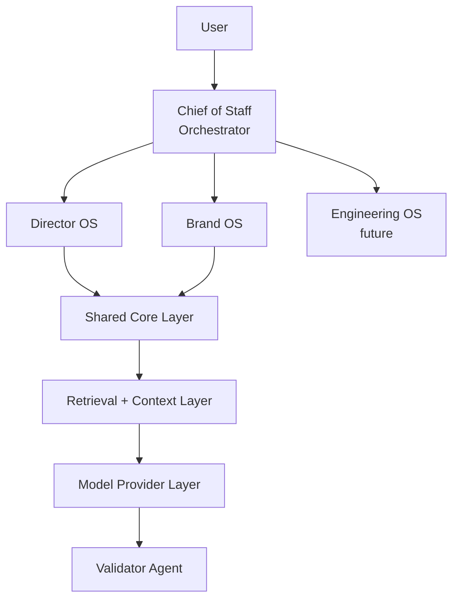

# AI Operating System (AI-OS)

AI-OS is a local-first, multi-agent AI system designed to help technical leaders operate effectively across:

- `Director OS`: project management, team insights, executive reporting
- `Brand OS`: podcast, open source, thought leadership, content creation

Built with a focus on:

- Privacy by default, with local-first operation and no internet requirement
- Cost-conscious defaults using local models
- Modular agent architecture
- Grounded, evidence-based outputs
- Pluggable model providers, starting local and extending to hybrid setups when needed

## Why This Exists

Technical leaders operate across fragmented systems:

- Jira for project tracking
- Docs for context and planning
- Meetings for decisions and follow-up
- Repositories for execution

This creates:

- Information overload
- Lost context across tools
- Time spent synthesizing instead of deciding

AI-OS exists to turn fragmented inputs into structured, actionable insight without defaulting to cloud-dependent or opaque agent behavior.

## Purpose

AI-OS is not a generic chatbot.

It is a structured system of agents intended to help you:

- Synthesize information across multiple sources
- Surface risks and insights
- Turn work into content and influence
- Operate consistently across projects and personal brand efforts

## System Overview


```mermaid
flowchart TD
    U[User] --> O[Chief of Staff<br/>Orchestrator]

    O --> D[Director OS]
    O --> B[Brand OS]
    O --> E[Engineering OS<br/>future]

    D --> S[Shared Core Layer]
    B --> S

    S --> R[Retrieval + Context Layer]
    R --> M[Model Provider Layer]
    M --> V[Validator Agent]
```

`Engineering OS` is a future extension for code-oriented workflows such as repository analysis, implementation assistance, and engineering execution support.

## Director OS

Focus: day-to-day leadership and operational clarity.

Responsibilities:

- Project status synthesis
- Risk and blocker detection
- Meeting and 1:1 insights
- Executive update generation

Example inputs:

- Jira exports
- Roadmap documents
- Meeting notes
- 1:1 notes

Example outputs:

- Weekly leadership update
- Top risks and blockers
- Project health summaries

## Brand OS

Focus: personal brand, content, and influence.

Responsibilities:

- Insight extraction from real work
- Content generation for posts, podcast ideas, and workshops
- Open source positioning
- Idea generation

Example inputs:

- Local repositories
- Notes and experiments
- Workshop material
- Podcast drafts

Example outputs:

- LinkedIn posts
- Podcast episode ideas
- README improvements
- Workshop explanations

## Core Components

### Orchestrator (Chief of Staff)

- Interprets user requests
- Routes tasks to agents
- Aggregates outputs

### Domain Agents

Specialized agents with strict roles, such as:

- Project Intelligence
- Team Signal
- Insight
- Content

### Retrieval Layer

- Searches local data sources
- Provides grounded context to agents
- Reduces hallucination by limiting scope to retrieved evidence

### Model Provider Layer

Layered by cost and locality:

| Layer | Model | Purpose |
| --- | --- | --- |
| Local inference | Ollama (`llama3.2`) | Free, on-device, default for routing and low-stakes synthesis |
| Cloud synthesis | Claude Haiku 4.5 | Cost-effective structured output via Anthropic SDK tool use |
| Premium synthesis | Claude Sonnet / Opus | On-demand for complex or high-stakes runs |

All providers implement the same `WeeklyUpdateProvider` interface. Switching providers is a single field change in the request — no workflow logic changes required. Cloud providers are opt-in and require `ANTHROPIC_API_KEY`.

### Validator Agent

Acts as the final quality gate and enforces:

- Evidence-based outputs
- Low verbosity
- No unsupported claims

## Design Principles

### Local-First

- No internet required
- All data remains on-device by default

### Grounded Outputs

- Responses should be based on retrieved context
- Non-trivial claims should include source references when evidence is available

### Structured Responses

- Short, actionable outputs
- Signal over noise

### Deterministic Workflows

- No uncontrolled autonomy
- Clear, repeatable execution paths

### Human-in-the-Loop

- The user retains final judgment and control

## Current Status

Both `Director OS` and `Brand OS` workflows are implemented and running:

- FastAPI service in `apps/api` with endpoints for both domains and a Chief of Staff orchestrator
- Operator console at `/` — trace-first local UI showing routing decisions, evidence sources, section counts, and model flags
- LangGraph-backed workflow graphs for `Director OS` (weekly update) and `Brand OS` (content draft)
- Layered model provider support: Ollama (local) and Claude Haiku 4.5 (Anthropic SDK, opt-in)
- Deterministic fallback when model synthesis fails or returns weak output
- LangSmith tracing and evaluation runners for both domains (`scripts/run_director_os_evals.py`, `scripts/run_brand_os_evals.py`)
- Checked-in evaluation sets under `evaluations/` with CI enforcement
- Shared provider, retrieval, validation, schema, and observability packages under `packages/shared`
- Sample local data under `data/local_only` for both project and brand workflows
- 69 tests across orchestration, graph behavior, evaluation scoring, API surface, and observability

The phased execution roadmap is documented in [plan.md](plan.md).

## Repository Structure (Target State)

The structure below reflects intended direction as the MVP grows:

```text
/ai-os
  /apps
    /web        # Frontend (e.g. Next.js)
    /api        # Backend (e.g. FastAPI)

  /packages
    /shared
      /prompts
      /schemas
      /retrieval
      /validation
      /providers

  /director_os
    agents/
    workflows/

  /brand_os
    agents/
    workflows/

  /data
    /local_only
      /projects
      /notes
      /repos
      /podcast

  /config
    models.yaml
    routing.yaml
```

## Technology Stack

| Layer | Tool | Role |
| --- | --- | --- |
| Language | Python 3.11+ | All orchestration, workflow, and API logic |
| API | FastAPI + Pydantic | Request validation, typed contracts, operator console |
| Workflow orchestration | LangGraph | Explicit state graphs with inspectable node transitions |
| Model provider (local) | Ollama | On-device inference, no API key required |
| Model provider (cloud) | Anthropic SDK — Claude Haiku 4.5 | Cost-effective structured output via tool use |
| Observability | LangSmith | Workflow tracing, eval experiments, cost tracking |
| Evaluation | Custom eval harness | Checked-in cases, local and LangSmith-backed runners |
| Retrieval | Local file retrieval (current) | Markdown-based evidence grounding |
| Retrieval (planned) | ChromaDB + sentence-transformers | Semantic vector search over local documents |
| CI/CD | GitHub Actions | Lint, test, eval enforcement on every PR |

The `lang*` frameworks are implementation infrastructure, not the product identity. AI-OS presents workflows, retrieval, validation, and operator control as its core concepts.

## Roadmap

The phased execution plan — including completed phases, in-progress work, and upcoming additions like an MCP server and ChromaDB semantic retrieval — is documented in [plan.md](plan.md).

## Non-Goals

This project intentionally does not aim to:

- Build fully autonomous agents
- Replace human decision-making
- Maximize agent complexity or parallelism for its own sake
- Require cloud APIs for core functionality (cloud providers are opt-in, not required)

The focus is on clarity, reliability, grounded reasoning, and operator control.

## Example Workflows

### Director OS

Input:

```text
Prepare my weekly update
```

Output:

- Key wins
- Risks and blockers
- Next steps
- Evidence-backed insights

### Brand OS

Input:

```text
I worked on RAG evaluation this week
```

Output:

- Insight summary
- Content draft such as a post or outline
- Potential podcast topic
- Repository improvement suggestions

## Quickstart

Requirements:

- Python 3.11+

Install dependencies:

```bash
python -m venv .venv
source .venv/bin/activate          # macOS / Linux
# .venv\Scripts\activate           # Windows
pip install -e ".[dev]"
```

Configure environment variables:

```bash
cp .env.example .env
# Fill in ANTHROPIC_API_KEY and/or LANGSMITH_API_KEY as needed.
# The system runs fully without either — both are opt-in.
```

Run the local API:

```bash
uvicorn apps.api.main:app --reload --env-file .env
```

Open the operator console:

```text
http://127.0.0.1:8000/
```

What the operator console is:

- A local inspection UI for the AI-OS orchestrator
- A simple way to see which workflow was selected and why
- A readable trace view for evidence sources, section counts, model flags, and fallback state

How to use it:

1. Enter a prompt that describes the work you want done.
2. Leave `Workflow` on `Auto-select` to test routing, or pick a workflow explicitly.
3. Set `Data Path` to the local project or brand notes you want searched.
4. Run the request and inspect the trace panels on the right.

Useful first tests:

- `Prepare my leadership weekly update` with `data/local_only/projects`
- `Turn this work into a podcast and LinkedIn content draft` with `data/local_only/brand`

Call the Phase 1 MVP endpoint:

```bash
curl -X POST http://127.0.0.1:8000/director-os/weekly-update \
  -H "Content-Type: application/json" \
  -d '{
    "data_path": "data/local_only/projects",
    "focus": "leadership update",
    "max_documents": 5
  }'
```

Call the Chief of Staff orchestrator endpoint:

```bash
curl -X POST http://127.0.0.1:8000/orchestrate \
  -H "Content-Type: application/json" \
  -d '{
    "prompt": "Prepare my leadership weekly update",
    "data_path": "data/local_only/projects",
    "max_documents": 10
  }'
```

The orchestrator response includes:

- the selected workflow and routing rationale
- a `trace` object with evidence count, source files, section counts, and fallback status
- the workflow result payload

Call the Brand OS workflow directly through the orchestrator:

```bash
curl -X POST http://127.0.0.1:8000/orchestrate \
  -H "Content-Type: application/json" \
  -d '{
    "prompt": "Turn this work into a podcast and LinkedIn content draft",
    "data_path": "data/local_only/brand",
    "max_documents": 5
  }'
```

Call with Ollama-backed synthesis (local model, no API key required):

```bash
curl -X POST http://127.0.0.1:8000/director-os/weekly-update \
  -H "Content-Type: application/json" \
  -d '{
    "data_path": "data/local_only/projects",
    "focus": "leadership update",
    "max_documents": 5,
    "use_model": true,
    "provider": "ollama",
    "ollama_url": "http://127.0.0.1:11434",
    "ollama_model": "llama3.2"
  }'
```

Call with Claude Haiku synthesis (requires `ANTHROPIC_API_KEY`):

```bash
curl -X POST http://127.0.0.1:8000/director-os/weekly-update \
  -H "Content-Type: application/json" \
  -d '{
    "data_path": "data/local_only/projects",
    "focus": "leadership update",
    "max_documents": 5,
    "use_model": true,
    "provider": "claude",
    "claude_model": "claude-haiku-4-5-20251001"
  }'
```

Run the eval set against the Claude provider (requires `ANTHROPIC_API_KEY`):

```bash
python scripts/run_director_os_evals.py --provider claude
```

Run tests:

```bash
pytest
```

Run the checked-in `Director OS` evaluation set locally on demand:

```bash
python scripts/run_director_os_evals.py
```

This local mode is the default quality-check path:

- it runs fully on demand
- it does not require LangSmith
- it is also the version enforced in CI today

Run the checked-in `Brand OS` evaluation set locally on demand:

```bash
python scripts/run_brand_os_evals.py
```

Run the same evaluation set on demand with LangSmith result upload enabled:

```bash
python scripts/run_director_os_evals.py --langsmith
```

Use the LangSmith-backed mode when you want experiment history, evaluator results in the LangSmith UI, or a shareable compare link.

For LangSmith-backed eval runs:

- Set `LANGSMITH_API_KEY`, `LANGSMITH_TRACING=true`, and `LANGSMITH_PROJECT=ai-os`
- US workspaces use the default endpoint
- EU workspaces must set `LANGSMITH_ENDPOINT=https://eu.api.smith.langchain.com`
- Run the command from the same terminal session where those env vars are set

## Important Notes

- This system is not autonomous
- Agents operate within strict constraints
- Accuracy and clarity are prioritized over creativity
- Local execution and cost-efficient operation are default design requirements
- Outputs should be reviewed before external use

## Contributing

Contributions are welcome.

Useful focus areas:

- Agent design patterns
- Local-first AI workflows
- Retrieval and grounding improvements
- UI and UX improvements for structured workflows

## SDLC and CI

The project uses lightweight GitHub Actions to keep quality checks cheap and fast:

- Repository checks run on pull requests to `main`, on pushes, and through manual dispatch
- Python checks automatically run when a `pyproject.toml`-based MVP exists
- CI installs the project, runs `ruff`, compiles Python sources, runs `pytest` with coverage output, and executes the local `Director OS` and `Brand OS` eval runners
- Concurrency cancellation is enabled to avoid wasting minutes on stale branch runs
- Tag-based release workflows build Python artifacts without introducing paid deployment tooling

The intent is to keep the workflow production-minded without adding paid infrastructure or unnecessary pipeline complexity early.

## Final Thought

> This is not just an AI project.
> It is a system designed to help you think, decide, and operate better.
