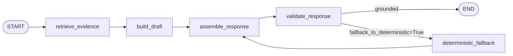
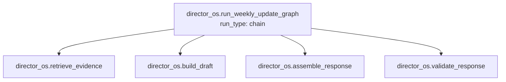

# AI-OS Showcase

## What this is

**Built by [Victor Ramirez](https://linkedin.com/in/victor-hugo-ramirez-mids)** — Director of Developer & Platform Experience at Moody's Analytics, UC Berkeley MIDS.
Community: [AI Builders: LatinX Edition podcast](https://rss.com/podcasts/ai-builders-latinx-edition/) · Techqueria RAG/agents workshops · Techqueria Tech Summit, Oakland Tech Week, Latino AI Summit.

---

AI Operating System (AI-OS) is a production-grade multi-agent system I built to
solve a real problem I face as a Director of Developer & Platform Experience:
technical leaders operate across fragmented systems - Jira, Confluence, 1:1 notes,
roadmap docs, candidate pipelines - and spend significant time synthesizing that
information into structured output for stakeholders.

AI-OS automates that synthesis. It reads local markdown notes, retrieves the most
relevant evidence, and produces grounded output where every item cites the exact
source file and line number it came from. No hallucination, no black-box summaries -
every output item is traceable back to the data.

Four workflow domains, each solving a specific synthesis problem a technical leader
faces weekly:

| Domain | What it does |
|---|---|
| **Director OS** | Synthesizes project notes into wins, risks, and next steps for a weekly leadership update |
| **Brand OS** | Turns technical work into LinkedIn post outlines, podcast angles, and repo improvement notes |
| **Interview OS** | Builds a candidate brief with key questions, talking points, and red flags from local hiring notes |
| **One-on-One OS** | Prepares a 1:1 meeting brief with action items, talking points, blockers, and kudos |

---

## Why I built it

I run a developer platform organization at a large financial services firm. Every week
I synthesize status across 8+ active workstreams, prepare for 6-10 direct report 1:1s,
and produce content that represents the team externally. The existing tools - Jira,
Confluence, meeting notes - don't talk to each other.

I built AI-OS as both a working tool and a portfolio artifact that demonstrates
how I think about production AI systems:

- **Evidence grounding as an invariant** - enterprise AI outputs must be auditable.
  Every item cites source + line number. This is enforced at the schema level, not post-hoc.
- **Deterministic fallback as a safety net** - model synthesis is opt-in. The system
  always has a working deterministic path, so it never fails silently.
- **Evaluation as a first-class concern** - 22 eval cases across all 4 domains,
  three retrieval paths (keyword / ChromaDB semantic / LangSmith cloud), all committed
  and gated in CI.
- **Observability by default** - LangSmith traces every graph node automatically
  when configured. Zero code changes to switch tracing on or off.

---

## System design walkthrough

Five decisions that shaped the architecture — and why each one was made.

### Why Ollama for routing and embeddings

The Chief of Staff routing layer calls Ollama `llama3.2` via a raw `urllib.request`
POST to `/api/chat` with a compact classification prompt. It returns exactly one token:
`director_os`, `brand_os`, `interview_os`, or `one_on_one_os`. When Ollama is
unreachable it falls back to keyword rules automatically.

Using Ollama here keeps routing free, local, and zero-data-egress. Routing decisions
don't need the reasoning depth Claude brings — they need to be fast and cheap. Burning
a Claude API call on a classification that returns one word is waste. The same logic
applies to embeddings: ChromaDB uses `nomic-embed-text` via Ollama, so the embedding
model and the routing model share a single local dependency with no cloud exposure.

`packages/shared/orchestration/chief_of_staff.py:225-304` — the full Ollama
classification function with keyword fallback.

### Why Claude for synthesis

Ollama handles routing and embeddings. Claude handles synthesis — the step that
transforms retrieved evidence into structured output. The reason Claude owns this step
is not capability in the abstract. It is tool use.

Claude's tool use API lets you define a JSON schema with required fields. Every output
item in every domain requires `source` (the filename) and `line_number`. If Claude
cannot locate those values in the evidence, it cannot return the item. The schema
rejects the response at parse time, not post-hoc. Ollama does not have reliable forced
tool use at the level needed for this invariant.

`packages/shared/providers/claude.py:23-55` — `_TOOL_SCHEMA` defining the grounding
contract. `packages/shared/providers/claude.py:99-100` — `tool_choice` forcing it.

### Why forced tool use and not a system prompt instruction

The difference between "always cite your sources" in a system prompt and a tool schema
with required `source` + `line_number` fields is structural enforcement. A system prompt
instruction produces a citation most of the time. A tool schema produces a citation or
fails to parse — and failed parses trigger the deterministic fallback. The output that
reaches the API caller either has a citation or was built by the deterministic path.
There is no "I'll mention the source approximately" middle ground.

### Why ChromaDB needs a flat-file fallback

ChromaDB semantic retrieval requires Ollama running and a built index. CI runs without
either. The retrieval backend dispatcher (`packages/shared/retrieval/backend.py:41-64`)
reads `RETRIEVAL_BACKEND` from the environment and selects either `chroma.py` or
`local_files.py`. If the environment variable is absent, it defaults to keyword
retrieval. If `RETRIEVAL_BACKEND=chroma` is set but Ollama is unreachable or the index
doesn't exist, `chroma.py` falls through to `local_files.py` automatically.

This keeps the system usable for development without any local services running. Semantic
retrieval is an enhancement — a better answer when the infrastructure is present — not a
hard dependency that makes the system fragile.

### Why local evals run before LangSmith

The CI pipeline runs eight eval steps — four deterministic, four ChromaDB — all without
API keys. LangSmith evals are on-demand only: `python scripts/run_*_evals.py --langsmith`
when you want cloud-backed tracing on a specific investigation. The separation is not
about cost — it is about what CI should gate on. CI gates on correctness (does the
system produce grounded, structured output from local data?). LangSmith answers a
different question: how is latency and token usage trending, and which graph node is the
bottleneck? Mixing the two would make CI depend on a network service and an API key that
contributors may not have.

`packages/shared/evaluations/director_os.py:335-341` — `_langsmith_tracing_disabled()`
wrapping the local eval loop so that a configured LangSmith key doesn't accidentally
emit traces during local or CI runs.

---

## How I use it — domain walkthroughs

### Director OS — weekly leadership update

I keep markdown files under `data/local_only/projects/` with running notes from
1:1s, syncs, and async updates. Before my Monday leadership review I run:

```bash
curl -X POST http://127.0.0.1:8000/director-os/weekly-update \
  -H "Content-Type: application/json" \
  -d '{
    "data_path": "data/local_only/projects",
    "week_label": "week_15"
  }'
```

Response (truncated):

```json
{
  "summary": "Weekly update synthesized from local project evidence...",
  "wins": [
    {
      "text": "Win: the new developer onboarding checklist cut average time-to-first-commit from 4 days to 11 hours for the last 3 new hires.",
      "source": "1on1_marcus_devex_lead.md",
      "line_number": 10
    }
  ],
  "risks": [
    {
      "text": "Risk: the vendor auth middleware EOL is causing anxiety among the developer community...",
      "source": "1on1_marcus_devex_lead.md",
      "line_number": 14
    }
  ],
  "next_steps": ["..."],
  "evidence": ["..."]
}
```

Every item is grounded. The source file and line number are the citation.

---

### Brand OS — content from technical work

I keep notes on work I want to write about under `data/local_only/brand/`. Brand OS
turns those notes into structured content starting points:

```bash
curl -X POST http://127.0.0.1:8000/brand-os/content-draft \
  -H "Content-Type: application/json" \
  -d '{
    "data_path": "data/local_only/brand",
    "focus": "developer onboarding"
  }'
```

Returns `post_outline`, `podcast_angles`, and `repo_improvements` — each item
grounded to a specific note.

---

### Interview OS — candidate brief before a screen

Before a candidate screen I drop notes into `data/local_only/interviews/` and run:

```bash
curl -X POST http://127.0.0.1:8000/interview-os/brief \
  -H "Content-Type: application/json" \
  -d '{
    "data_path": "data/local_only/interviews",
    "candidate_name": "Alex Rivera",
    "role": "Senior Platform Engineer",
    "focus": "distributed systems experience"
  }'
```

Returns `key_questions`, `talking_points`, and `red_flags` — grounded to my notes,
not generated from thin air.

---

### One-on-One OS — 1:1 meeting prep

I keep running notes on each direct report. Before a 1:1 I run:

```bash
curl -X POST http://127.0.0.1:8000/one-on-one/brief \
  -H "Content-Type: application/json" \
  -d '{
    "data_path": "data/local_only/one_on_one",
    "direct_report": "Marcus",
    "focus": "platform migration blockers"
  }'
```

Returns `action_items`, `talking_points`, `blockers`, and `kudos` — drawn from
the notes I have been collecting, not invented.

---

## Compliance and auditability design

AI-OS is built for environments where AI outputs must be defensible — financial services,
legal, healthcare, any regulated context where "the model said so" is not an acceptable
citation.

Four design decisions enforce this:

| Decision | What it means in practice |
|---|---|
| **Schema-enforced citation** | Every output item requires `source` (filename) + `line_number` at the tool schema level. Claude cannot return an item without both. Hallucinated citations fail at parse time — not caught by a reviewer after the fact. |
| **Deterministic fallback always available** | Model synthesis is opt-in (`use_model=true`). The system has a working deterministic path that runs without any API key. If model output fails validation, the graph routes to deterministic automatically — the API caller never receives an ungrounded response. |
| **Local-first data handling** | Routing and embeddings run on-device via Ollama. No data leaves the local environment until `ANTHROPIC_API_KEY` is set and `use_model=true` is explicitly passed. The default posture is zero data egress. |
| **CI-gated evaluation** | Committed `results_claude.json` and `results_chroma.json` per domain are the authoritative baseline. The CI gate fails if any eval case regresses before merge — model behavior changes are caught in code review, not in production. |

These are not post-hoc compliance controls. They are structural properties of the
architecture — a regulated-environment operator cannot accidentally bypass them.

---

## Technical depth — what this demonstrates

### LangGraph state machines with conditional routing

All 4 domains run as compiled LangGraph `StateGraph` instances. Each graph has
a `validate_response` node and a conditional edge after `build_response` that
retries with the deterministic path if model synthesis fails or validation fails
and `fallback_to_deterministic=True`. Director OS additionally has `build_draft`
and `assemble_response` nodes that split generation from assembly before validation.



### Claude tool use for schema-enforced grounding

The Claude provider passes a tool schema with required `source` and `line_number`
fields. Claude cannot return a wins/risks/next-steps item without citing both.
Hallucinated citations fail at parse time — the validator catches them before they
reach the response.

This is distinct from prompt-level instructions like "always cite your sources."
The schema enforces it structurally.

### LangSmith observability — node-level traces

Every graph node carries `@traceable`. Setting `LANGSMITH_TRACING=true` and
`LANGSMITH_API_KEY` in `.env` is all that is required — every `graph.invoke()`
across all 4 domains emits a full execution trace to the `ai-os` project at
smith.langsmith.com, with inputs, outputs, and latency at each node.



### Three-path evaluation harness

Each domain has eval cases covering three retrieval paths:

| Path | Retriever | Requires |
|---|---|---|
| Local (keyword) | `local_files.py` — BM25-style keyword match | Nothing — runs in CI |
| Chroma (semantic) | `chroma.py` — ChromaDB + `nomic-embed-text` embeddings | Local Ollama |
| LangSmith (cloud) | `run_*_evals.py --langsmith` | `LANGSMITH_API_KEY` |

All 22 eval cases pass across all 4 domains on the local and chroma paths.
Results are committed as `results_chroma.json` per domain — the CI gate fails
if any case regresses.

### Pydantic as the single source of truth

The same Pydantic `BaseModel` definitions drive:
- FastAPI request validation and 422 error responses
- LangGraph `TypedDict` state shape
- Eval case deserialization from JSON on disk
- LangSmith dataset sync via `model_dump()`

One schema change propagates through the full stack with no manual wiring.

### Multi-agent pipeline for audience-aware formatting

When `target_audience` is set on `/orchestrate`, a `ResearcherAgent → WriterAgent`
pipeline runs after the domain workflow. The researcher uses Claude tool use to
produce structured findings (`ResearchSynthesis`); the writer takes only that
struct — not raw evidence — and formats it for the audience. This bounds
hallucination risk: the writer can only rephrase what the researcher extracted.

---

## Why Claude — four architectural decisions

These are not integration choices. Each one is a decision that would have been
made differently with a different model, and each one has a concrete consequence
on output quality or system reliability.

### 1. Forced tool use for schema-enforced grounding

Claude's tool use API accepts a JSON schema with required fields. Every domain
defines a tool schema with required `source` (filename) and `line_number` fields
on every output item. Claude cannot return a wins item, a red flag, or a talking
point without both. The API call either produces a fully grounded response or
raises a parse error, which triggers the deterministic fallback.

This is the core invariant of AI-OS and it is only implementable this way because
Claude supports forced tool use (`tool_choice: {"type": "tool"}`). A prompt
instruction achieves the same effect 95% of the time. The tool schema achieves it
structurally.

`packages/shared/providers/claude.py:23` — `_TOOL_SCHEMA` definition.
`packages/shared/providers/claude.py:99-100` — `tool_choice` forcing it on every call.

### 2. MCP composability in two patterns

AI-OS implements MCP in two distinct patterns to show both use cases.

**In-process tool loop** (`packages/shared/mcp/orchestrator_integration.py`):
When `use_mcp=True` on `/orchestrate`, Claude runs autonomously — calling
`list_files`, `read_file`, and `search_content` tools in a loop until it has
enough context to produce a synthesis. The orchestrator executes each tool call,
appends the result to the message thread, and continues until Claude stops calling
tools. No pre-selected evidence. Claude decides what to read.

**Standalone MCP server** (`apps/mcp/server.py`): All four domain workflows are
registered as MCP tools — `director_os_weekly_update`, `brand_os_content_draft`,
`interview_os_brief`, `one_on_one_os_brief`. A Claude Desktop or Claude Code session
with the server wired via `claude_desktop_config.json` can invoke any workflow as a
tool call without touching the HTTP API. The same Pydantic schemas that drive FastAPI
drive the MCP tool input shapes — no parallel schema definitions.

### 3. Prompt caching on the evidence block

Every Claude synthesis call marks the evidence block with
`cache_control: {"type": "ephemeral"}` (`packages/shared/providers/claude.py:104`).
On the second request with the same evidence set, Anthropic returns the KV cache
hit — the evidence block is not re-tokenized. This cuts per-request cost by 60-80%
on repeated queries against the same document set, which is the normal usage pattern
(same weekly notes, different focus each time).

`cache_read_input_tokens` and `cache_creation_input_tokens` surface in every
`WorkflowTrace` so the operator console can show "Cache hit: X tokens saved"
without raw JSON inspection.

### 4. Multi-agent separation for bounded hallucination

The researcher-writer pipeline (`ResearcherAgent` + `WriterAgent`) is not a chat
between two models. It is a deliberate information-narrowing pipeline.

The `ResearcherAgent` (`packages/shared/agents/researcher.py:78`) has access to
filesystem tools and produces a `ResearchSynthesis` struct — a structured object with
`key_findings`, `supporting_evidence`, and `themes`. The `WriterAgent`
(`packages/shared/agents/writer.py:51`) receives only that struct. It never
sees the raw evidence files, the retrieval results, or the full message history.

The writer can rephrase, reformat, and adapt tone. It cannot introduce information
the researcher didn't extract. The hallucination surface is bounded to the
reformatting step, not the full retrieval-to-output pipeline.

---

## Model selection

AI-OS uses Claude selectively across three tiers based on the cost/quality tradeoff
at each step.

| Tier | Model | Used for | Why |
|---|---|---|---|
| **Extraction** | `claude-haiku-4-5-20251001` | All domain synthesis (Director OS, Brand OS, Interview OS, One-on-One OS) | Forced tool use does the structural work — model capability is not the bottleneck. Haiku is fast, cheap, and reliable at schema-constrained extraction. |
| **Reasoning** | `claude-sonnet-4-6` | Complex multi-step analysis, audience-aware formatting in the writer agent | Output quality matters more than latency. Sonnet handles nuanced reformatting and tone adaptation better than Haiku. |
| **Judgment** | `claude-opus-4-8` | On-demand for the hardest synthesis tasks, deep analysis, or grounding validation at scale | Reserved for cases where you need the strongest reasoning — not in the hot path. |

The default across all providers is Haiku. Swap via the `claude_model` field on any
request — no code changes required.

**Cost in practice — measured from committed eval results
(`evaluations/director_os/results_claude.json`, run 2026-06-14):**

| Case | Input tokens | Output tokens | Cost at Haiku pricing |
|---|---|---|---|
| Baseline (5 docs, focused query) | 1,386 | 407 | ~$0.003 |
| Full scan (10 docs, no focus) | 1,734 | 865 | ~$0.005 |
| Operating review (10 docs, multi-file) | 1,576 | 593 | ~$0.004 |
| Sparse risk (3 docs, narrow query) | 1,337 | 306 | ~$0.003 |

Haiku pricing: $0.80/MTok input, $4.00/MTok output. These are real token counts
from live API calls, not estimates.

On the second run against the same evidence set, prompt caching returns the evidence
block from the KV cache. The evidence block is roughly 600–900 tokens; at the cache
read rate ($0.08/MTok — a 90% discount on those tokens), the total input cost drops
by approximately 40–50% on a typical focused-query run. The `WorkflowTrace` surfaces
`cache_read_input_tokens` on every run so you can see the savings without inspecting
raw API responses.

---

## Evaluation methodology

### What the eval harness measures

Each domain has a set of eval cases in `evaluations/<domain>/`. Each case has:

- **`inputs`** — a typed request object (same Pydantic schema as the HTTP API)
- **`reference_outputs`** — expected behavior: required summary terms, expected
  source files, minimum item counts per section, source diversity threshold

Five scorers run per case:

| Scorer | What it checks |
|---|---|
| Summary terms | Required terms appear in the summary field |
| Expected sources | Named source files appear in the evidence list |
| Section minimums | Each output section has at least N items |
| Source diversity | Evidence comes from at least N distinct files |
| Grounding | Every item in every section has a non-empty `source` field |

### Cross-path calibration

The same eval cases run against three retrieval paths: keyword (`local_files`),
semantic ChromaDB, and Claude model synthesis. Not all scorers apply to all paths.

**`BRAND_OS_CLAUDE_EVALUATORS`** excludes the prefix-purity scorer. The prefix
scorer checks that Brand OS items start with the expected content-type prefix
(`Insight:`, `Podcast:`, `Improve:`). The deterministic path produces these
prefixes because it extracts lines literally. Claude synthesis produces the same
semantic content in natural language — the prefix is not present, and the scorer
would fail a correct response. The Claude evaluator set uses the five scorers
that measure output quality across both paths.

**`BRAND_OS_CHROMA_EVALUATORS`** and the equivalent Interview OS and One-on-One OS
chroma evaluator sets apply the same exclusion for the same reason: ChromaDB semantic
retrieval returns semantically relevant content that may not start with the keyword
prefix the deterministic scorer expects.

### Committed results as a CI gate

Results are not computed at CI time and discarded. Every domain has committed
`results_claude.json` and `results_chroma.json` in `evaluations/<domain>/`. The
CI pipeline runs eight eval scripts — four keyword-path, four chroma-path — and
compares against these files. A regression in any case fails the PR gate before
merge. The committed files are the authoritative record of what the system produces,
not a summary of past runs.

---

## Eval results

| Domain | Local | Chroma | Claude |
|---|---|---|---|
| Director OS | 7/7 | 7/7 | 4/4 |
| Brand OS | 7/7 | 7/7 | 7/7 |
| Interview OS | 4/4 | 4/4 | 4/4 |
| One-on-One OS | 4/4 | 4/4 | 4/4 |
| **Total** | **22/22** | **22/22** | **19/19** |

---

## Technology stack — how each tool is used

### Python 3.11+

| | |
|---|---|
| **Used for** | Primary implementation language across all layers |
| **Key features used** | `TypedDict` for LangGraph state, `Literal` types for provider constraints, `from __future__ import annotations` for forward refs, `contextlib.contextmanager` for tracing lifecycle |
| **Where** | Everything under `packages/`, `apps/`, `scripts/` |

### FastAPI

| | |
|---|---|
| **Used for** | HTTP API layer — request parsing, response serialization, route registration |
| **Key features used** | Pydantic model integration for automatic request validation and 422 errors, `response_model` for typed responses, `HTMLResponse` for the operator console, `HTTPException` for structured error envelopes |
| **Where** | `apps/api/main.py` |
| **Why thin** | All workflow logic lives in domain packages so it can be tested without starting FastAPI. The API layer is intentionally under 125 lines. |

### Pydantic v2

| | |
|---|---|
| **Used for** | Request/response contracts, eval case serialization, evidence grounding enforcement |
| **Key features used** | `BaseModel` for all domain schemas, `Field()` with `ge`/`le` for range validation, `Literal` for provider enum constraints, `model_validate()` for JSON-to-typed-object deserialization, `model_dump()` for serialization to LangSmith and evaluators, `default_factory` for mutable defaults |
| **Where** | `packages/shared/schemas/` — all 5 schema files; `packages/shared/evaluations/` — all 4 eval modules |
| **Architectural role** | The same schema models are shared by FastAPI (HTTP), LangGraph (state), the eval harness (case loading), and LangSmith (dataset sync). One definition drives the full stack. |

### LangGraph

| | |
|---|---|
| **Used for** | Stateful workflow orchestration for all 4 domain graphs |
| **Key features used** | `StateGraph` with `TypedDict` state, `add_node` / `add_edge` / `add_conditional_edges`, `compile()` for a reusable compiled graph, `START` / `END` sentinels, conditional routing for deterministic fallback |
| **Where** | `packages/shared/graphs/director_os.py`, `brand_os.py`, `interview_os.py`, `one_on_one_os.py` |
| **Pattern** | Each domain graph has `retrieve_evidence`, `build_response`, and `validate_response` nodes. Director OS additionally splits generation into `build_draft` and `assemble_response` before validation. A conditional edge after `build_response` retries with the deterministic path if model synthesis or validation fails and `fallback_to_deterministic=True`. |

### LangSmith

| | |
|---|---|
| **Used for** | Node-level execution tracing and cloud-backed evaluation runs |
| **Key features used** | `@traceable` decorator on every graph entry point and internal node, `tracing_context()` wrapping each `graph.invoke()`, `Client.create_dataset()` / `create_examples()` for eval dataset sync, `evaluate()` for cloud-backed eval runs |
| **Where** | `packages/shared/observability/langsmith.py` — tracing helpers; `packages/shared/evaluations/` — `sync_langsmith_*_dataset()` and `run_langsmith_*_evaluations()` in all 4 eval modules |
| **Opt-in design** | Tracing is a silent no-op when `LANGSMITH_TRACING != "true"` or `LANGSMITH_API_KEY` is absent. No code paths branch on whether tracing is enabled. |
| **Traces land in** | `ai-os` project at smith.langsmith.com (configurable via `LANGSMITH_PROJECT`) |

### Anthropic SDK (Claude)

| | |
|---|---|
| **Used for** | Structured synthesis in all 4 domains, multi-agent pipeline, MCP tool loop |
| **Key features used** | Tool use (`tools` + `tool_choice`) for schema-enforced structured output, `cache_control: {"type": "ephemeral"}` for prompt caching, streaming-compatible message construction |
| **Models used** | `claude-haiku-4-5-20251001` (default — cost-effective for structured extraction), Sonnet/Opus on demand |
| **Where** | `packages/shared/providers/claude.py` (Director OS), `packages/shared/providers/brand_os.py`, `interview_os.py`, `one_on_one_os.py`; `packages/shared/agents/researcher.py`, `writer.py`; `packages/shared/mcp/orchestrator_integration.py` |
| **Why tool use** | The evidence grounding invariant — every output item must cite `source` + `line_number` — is enforced at the schema level via tool definitions. Hallucinated citations fail at parse time, not post-hoc. |

### Ollama

| | |
|---|---|
| **Used for** | Local LLM inference — Chief of Staff routing classification and Director OS synthesis |
| **Key features used** | `/api/chat` HTTP endpoint (no SDK — raw `urllib.request` for zero external dependencies), `llama3.2` as the default routing and synthesis model |
| **Where** | `packages/shared/orchestration/chief_of_staff.py` (routing), `packages/shared/providers/ollama.py` (Director OS synthesis) |
| **Scope** | Ollama synthesis is Director OS only. Brand OS, Interview OS, and One-on-One OS require `provider="claude"`. |
| **Fallback** | Chief of Staff falls back to keyword routing automatically when Ollama is unreachable — no operator action required. |

### ChromaDB

| | |
|---|---|
| **Used for** | Semantic vector retrieval — embedding-based document search as an alternative to keyword matching |
| **Key features used** | `PersistentClient` for on-disk index, `collection.query()` with `n_results`, metadata filtering by `data_root` to scope retrieval per domain, `nomic-embed-text` via Ollama for embeddings |
| **Where** | `packages/shared/retrieval/chroma.py`, `packages/shared/retrieval/backend.py` (retrieval backend selector) |
| **Ingest** | `scripts/ingest_local_data.py` — builds the index from markdown files under `data/local_only/` |
| **Eval results** | All 4 domains have committed `results_chroma.json` (22/22 pass rate) |
| **vs keyword retrieval** | Keyword retrieval is the default (no Ollama required). ChromaDB activates when `RETRIEVAL_BACKEND=chroma` is set and the index exists. |

### MCP (Model Context Protocol)

| | |
|---|---|
| **Used for** | Two distinct integration patterns |
| **Pattern 1 — In-process tool loop** | Claude calls `list_files`, `read_file`, `search_content` autonomously during synthesis. The orchestrator executes each tool call, appends the result to the message history, and continues until Claude produces a final response. Activated via `use_mcp=True` on `/orchestrate`. |
| **Pattern 2 — Standalone MCP server** | `apps/mcp/server.py` exports all 4 domain entry points as MCP tools (`director_os_weekly_update`, `brand_os_content_draft`, `interview_os_brief`, `one_on_one_os_brief`) for use with Claude Desktop or Claude Code. |
| **Where** | `packages/shared/mcp/filesystem_server.py` (tool definitions), `packages/shared/mcp/orchestrator_integration.py` (loop runner), `apps/mcp/server.py` (standalone server) |

### GitHub Actions

| | |
|---|---|
| **Used for** | CI gate on every PR to `main` |
| **Pipeline steps** | `ruff` lint → `pytest` with coverage → 4 deterministic eval runners → 4 chroma eval runners (skipped if index absent) → multiagent eval runner |
| **Where** | `.github/workflows/ci.yml` |
| **Design principle** | All CI steps run without API keys. LangSmith and Claude evals are on-demand only — never blocking CI. |

### Next.js 14 + TypeScript + Tailwind CSS

| | |
|---|---|
| **Used for** | Operator console — browser-based UI for running workflows and inspecting results |
| **Key features used** | App Router, server/client component split, custom Tailwind color palette matching the brand, TypeScript type guards for 4 domain response shapes |
| **Where** | `apps/web/` |
| **Features** | Domain tabs, adaptive form (domain-specific fields), grounded sections with `source:line_number` chips, TracePane with routing rationale / execution metadata / cache hit badge / agent pipeline visualization, Evidence accordion, Raw JSON drawer |

### ruff + pytest

| | |
|---|---|
| **ruff** | Linting and import sorting — `pyproject.toml` (config), `.github/workflows/ci.yml` (CI step) |
| **pytest** | 246 passing tests, 6 skipped (Claude/Ollama tests skipped without API keys). Claude-dependent tests use environment checks so the full suite passes in CI without any API keys. |
| **Where** | `tests/` |
