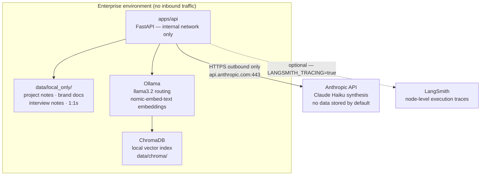

# AI-OS Enterprise Deployment Guide

This document describes how to deploy AI-OS in a regulated enterprise
environment where data residency, auditability, and change control
requirements constrain how AI systems are deployed and operated.

---

## Deployment architecture



No customer data is stored or logged by Anthropic by default. For
zero-data-retention (ZDR) requirements, contact Anthropic sales to negotiate
a ZDR agreement  -  this is a contract-level option, not a request header.
See: https://www.anthropic.com/privacy

---

## Pre-deployment checklist

### Authentication and secrets

- [ ] `ANTHROPIC_API_KEY` stored in a secrets manager (AWS Secrets Manager,
      Azure Key Vault, HashiCorp Vault)  -  never in source code or `.env`
      files committed to version control
- [ ] Key rotation schedule documented (recommend: 90 days)
- [ ] Outbound HTTPS to `api.anthropic.com:443` approved by InfoSec

### Data residency

- [ ] Confirm with InfoSec whether prompt content qualifies as PII or
      confidential data under your data classification policy
- [ ] If ZDR is required, engage Anthropic sales before sending production data
- [ ] Confirm that `data/local_only/` contents never contain regulated data
      (PII, PCI, HIPAA-covered information)
- [ ] For EU deployments: confirm Anthropic's data processing agreement
      satisfies GDPR Article 28 requirements

### Network controls

- [ ] AI-OS FastAPI service bound to `127.0.0.1` or internal VLAN only  - 
      never exposed to public internet
- [ ] Egress filter: allow only `api.anthropic.com:443`
- [ ] Proxy configuration documented if outbound traffic routes through
      a corporate proxy

### Change control

- [ ] Model version pinned in `config/models.yaml`  -  do not use `latest`
      aliases in production (model behaviour changes across versions)
- [ ] Eval gate (see below) passes before any production deployment
- [ ] Rollback procedure documented: revert to Ollama deterministic path
      by removing `ANTHROPIC_API_KEY` from secrets manager

---

## Eval gate (required before production deployment)

Run the Director OS eval set against the Claude provider and confirm results
meet the quality threshold before deploying or upgrading.

```bash
# Run evals (requires ANTHROPIC_API_KEY)
python scripts/run_director_os_evals_claude.py

# Check results
cat evaluations/director_os/results_claude.json | python -m json.tool | grep pass_rate
```

**Minimum acceptable pass rate: 60%**

If pass rate is below threshold:
1. Review failing cases in `evaluations/director_os/results_claude.json`
2. Check whether the model version changed (see `model` field in results)
3. Check whether source data quality has degraded
4. Do not deploy until threshold is met

---

## Provider configuration

`config/models.yaml` controls provider selection:

```yaml
# AI-OS model configuration
# ---
# provider: claude   → uses ANTHROPIC_API_KEY (production default)
# provider: ollama   → uses local Ollama (dev/offline fallback)
# provider: stub     → deterministic fake (CI without API key)

default_provider: claude
default_model: claude-haiku-4-5-20251001

# For higher-quality synthesis at higher cost:
# default_model: claude-sonnet-4-6

fallback_provider: ollama
fallback_model: llama3.2

max_tokens: 1024
```

---

## MCP server configuration

The filesystem MCP server reads from `data/local_only/` by default.

**To adapt to enterprise storage backends:**

| Storage type | Adapter approach |
|---|---|
| Network share (SMB/NFS) | Mount as local path, pass as `root_path` |
| SharePoint | Add `sharepoint_server.py` implementing same `call_tool()` interface |
| S3 / Azure Blob | Add `object_storage_server.py` with `list_files`, `read_file`, `search_content` |
| Confluence | Add `confluence_server.py` using Confluence REST API |

The orchestrator (`orchestrator_integration.py`) is storage-agnostic  - 
it calls `mcp_server.call_tool(name, input)` regardless of backend.

---

## Validator agent

AI-OS includes a validator agent that enforces:
- Evidence-based outputs (claims must be traceable to retrieved context)
- Low verbosity (no unsupported claims)
- Structured responses (actionable, not narrative)

Map these to your organization's AI governance requirements:

| AI-OS validator rule | Governance mapping |
|---|---|
| Evidence-based outputs | Outputs must be explainable and traceable to source data |
| No unsupported claims | AI must not extrapolate beyond retrieved context |
| Human-in-the-loop | AI outputs reviewed before any external communication |

---

## Monitoring and observability

All orchestrated responses include a `trace` object:

```json
{
  "trace": {
    "mcp_tool_calls": [
      {
        "tool": "read_file",
        "input": {"path": "projects/weekly-notes.md"},
        "success": true,
        "result_preview": "# Week of June 2026..."
      }
    ],
    "total_input_tokens": 842,
    "total_output_tokens": 312,
    "data_path": "data/local_only/projects"
  }
}
```

Log the `trace` object to your observability platform (Datadog, Splunk, etc.)
to create an audit trail of what data the AI accessed and what it produced.

For LangSmith tracing:

```bash
export LANGSMITH_API_KEY=<your-key>
export LANGSMITH_TRACING=true
export LANGSMITH_PROJECT=ai-os-production
```

---

## Incident response

**Scenario: Unexpected or harmful output**

1. Remove `ANTHROPIC_API_KEY` from secrets manager → system falls back to
   Ollama deterministic path automatically
2. Preserve the operator trace from the affected request
3. Review `mcp_tool_calls` in the trace to identify what data was retrieved
4. Re-run eval set against the same model version to assess scope

**Scenario: API key compromised**

1. Rotate key immediately in Anthropic Console
2. Update secrets manager with new key
3. Review API usage logs in Anthropic Console for unauthorized calls

---

## Deployment pattern summary

1. **Secrets management**  -  API key in vault, never in code
2. **Data residency**  -  confirm classification before enabling live API calls
3. **Eval gate**  -  run and commit eval results before every production deployment
4. **Provider abstraction**  -  Claude in prod, Ollama as fallback, no code changes required
5. **Operator trace**  -  every response includes what the agent read and why
6. **Validator**  -  enforce grounding and verbosity rules at the output layer
7. **Rollback**  -  remove API key to revert to deterministic path instantly
